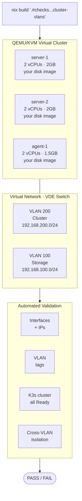
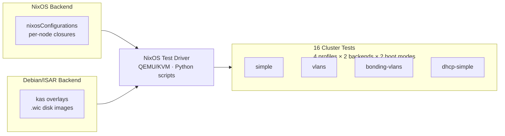
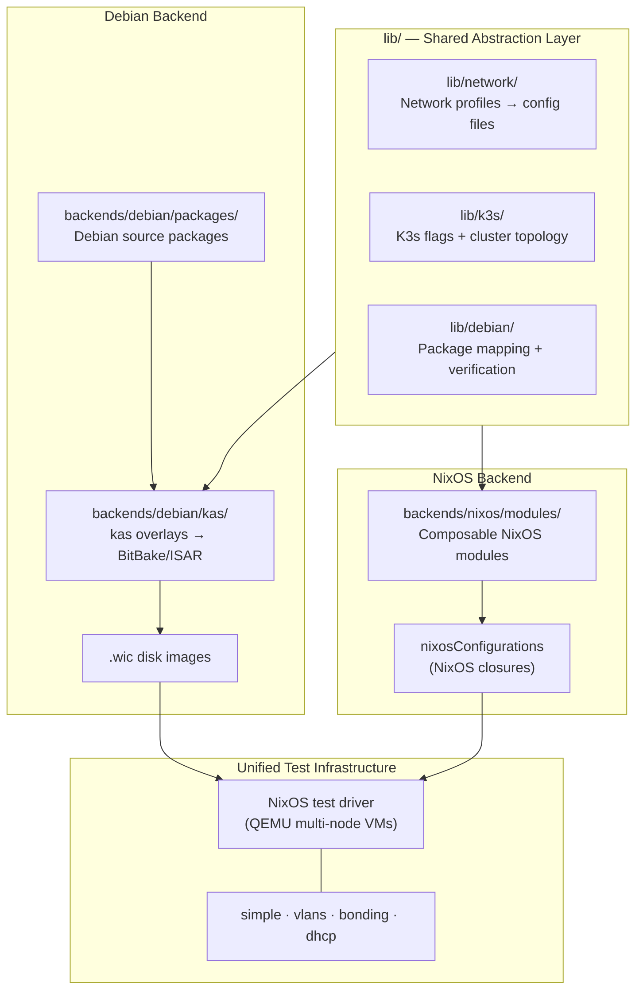
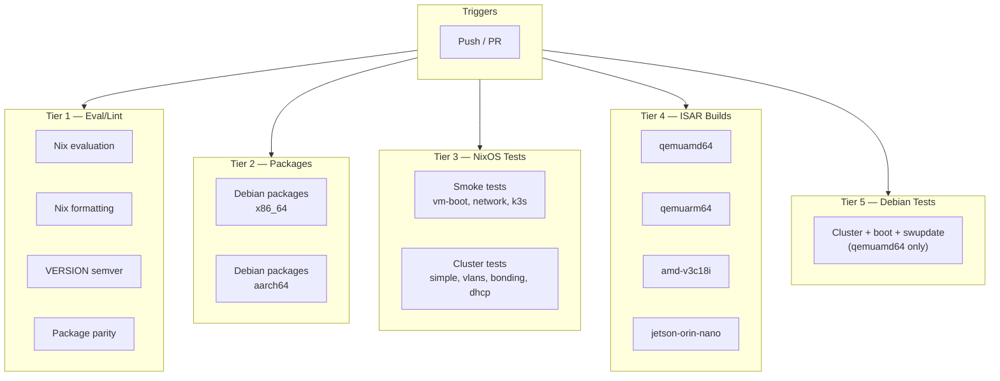

# n3x — K3s Edge Cluster Platform

n3x builds and tests K3s edge clusters. You build images with your existing tools — [kas/ISAR](https://github.com/ilbers/isar) for Debian, [Nix](https://nixos.org) for NixOS — and the framework automatically validates them: booting each image in QEMU, configuring virtual networks, forming a real K3s cluster, and reporting pass/fail. No hardware needed.

Every test boots real images in QEMU, wires up virtual networks, and validates K3s cluster formation end-to-end:



Both backends — NixOS and Debian/ISAR — share the same network profiles and converge at this test infrastructure.

## Getting Started

Choose your entry point based on what you want to do:

| Goal | Start Here |
|------|------------|
| Add an application package | [`backends/debian/packages/README.md`](backends/debian/packages/README.md) |
| Build Debian disk images | [`backends/debian/README.md`](backends/debian/README.md) |
| Configure NixOS infrastructure | [`backends/nixos/README.md`](backends/nixos/README.md) |
| Run VM tests | [`tests/README.md`](tests/README.md) |
| Modify network profiles or K3s topology | [`docs/GETTING-STARTED.md`](docs/GETTING-STARTED.md) |

For a guided walkthrough covering all paths, see [`docs/GETTING-STARTED.md`](docs/GETTING-STARTED.md).

## Building

### Debian Backend

The build matrix has 16 variants across 4 machines (42 total artifacts). The primary workflow builds images and registers them in the Nix store:

```bash
# Build and register ALL 16 variants
nix run '.'

# List all variants in the build matrix
nix run '.' -- --list

# Build one specific variant
nix run '.' -- --variant server-simple-server-1

# Build all variants for one machine
nix run '.' -- --machine qemuamd64

# Preview what would be built
nix run '.' -- --dry-run
```

Each variant is assembled from stacked kas overlays:

| Overlay          | Purpose                    | Examples                        |
|------------------|----------------------------|---------------------------------|
| `machine/`       | Target hardware            | `qemu-amd64`, `qemu-arm64`     |
| `packages/`      | Package sets               | `k3s-core`, `debug`            |
| `image/`         | Cluster role               | `k3s-server`, `k3s-agent`      |
| `network/`       | Network topology           | `simple`, `vlans`, `bonding`   |
| `node/`          | Per-node identity (IP, ID) | `server-1`, `agent-1`          |

For lower-level builds without Nix store registration:

```bash
nix develop
cd backends/debian
kas-build kas/base.yml:kas/machine/qemu-amd64.yml:kas/packages/k3s-core.yml:kas/packages/debug.yml:kas/image/k3s-server.yml:kas/network/simple.yml:kas/node/server-1.yml
```

See [`backends/debian/README.md`](backends/debian/README.md) for the full Debian build guide.

### NixOS Backend

NixOS host configurations are built and deployed using standard Nix tooling:

```bash
# Build a host configuration
nix build '.#nixosConfigurations.n100-1.config.system.build.toplevel'

# Deploy to a running host
nixos-rebuild switch --flake '.#n100-1' --target-host root@n100-1
```

See [`backends/nixos/README.md`](backends/nixos/README.md) for module composition and deployment.

## Testing

Both backends converge at the same test harness — the NixOS test driver — which orchestrates QEMU/KVM multi-node topologies via Python test scripts:



The test infrastructure emulates multi-node K3s clusters in VMs — booting real images, configuring networking, and validating cluster formation automatically. Tests run identically on developer laptops and CI, requiring only KVM. No physical hardware or cloud dependencies needed.

```bash
# Run ALL Debian tests (18 tests)
nix build '.#checks.x86_64-linux.debian-all'

# Run a single Debian test
nix build '.#checks.x86_64-linux.debian-cluster-simple' -L

# Run a NixOS backend test
nix build '.#checks.x86_64-linux.k3s-cluster-simple'

# Validate all artifact hashes without running tests
nix build '.#checks.x86_64-linux.debian-artifact-validation'
```

### Cluster Test Parity Matrix

| Network Profile | NixOS | Debian |
|-----------------|-------|--------|
| Simple (flat) | `k3s-cluster-simple` | `debian-cluster-simple` |
| 802.1Q VLANs | `k3s-cluster-vlans` | `debian-cluster-vlans` |
| Bonding + VLANs | `k3s-cluster-bonding-vlans` | `debian-cluster-bonding-vlans` |
| DHCP | `k3s-cluster-dhcp-simple` | `debian-cluster-dhcp-simple` |

Additional backend-specific tests cover boot validation, service startup, network debugging, OTA updates (Debian), and storage/failover scenarios (NixOS). See [`tests/README.md`](tests/README.md) for the full 45-check test catalog.

## Architecture



The `lib/` directory is the architectural center: it defines network profiles, K3s topology, and package requirements once, then each backend consumes them in its native format. Both backends converge at the test infrastructure, where identical test scenarios validate cluster formation across network profiles.

| Abstraction | NixOS Backend | Debian Backend |
|-------------|---------------|----------------|
| **Machine** | `system` + `hardware/<machine>.nix` | `MACHINE` + `recipes-bsp/` |
| **Role** | `modules/roles/k3s-server.nix` | `classes/k3s-server.bbclass` |
| **System** | `nixosConfigurations.<name>` | `kas/<overlays>.yml` + image recipe |
| **Network** | NixOS systemd-networkd module | `.network`/`.netdev` config files |
| **K3s Binary** | nixpkgs `k3s` package | Static binary from GitHub releases |
| **Test Harness** | nixosTest (native) | nixosTest (with .wic images) |

Shared configuration libraries ([`lib/network/`](lib/network/README.md), [`lib/k3s/`](lib/k3s/README.md)) transform profile data for both backends. See [`docs/diagrams/n3x-architecture.md`](docs/diagrams/n3x-architecture.md) for detailed architecture diagrams.

## Repository Structure

```
n3x/
├── backends/
│   ├── debian/                  # ← MOST DEVELOPERS WORK HERE
│   │   ├── packages/            #   ← ADD PACKAGES HERE
│   │   │   ├── k3s/             #     K3s binary + systemd service
│   │   │   └── k3s-system-config/ #   K3s cluster configuration
│   │   ├── kas/                 #   kas configuration overlays
│   │   │   ├── base.yml         #     Base ISAR config
│   │   │   ├── machine/         #     Target hardware definitions
│   │   │   ├── image/           #     Image roles (server, agent)
│   │   │   ├── network/         #     Network profiles
│   │   │   └── node/            #     Per-node identity
│   │   └── meta-n3x/            #   BitBake layer (recipes, WIC templates)
│   │
│   └── nixos/                   # NixOS backend — reference implementation
│       └── ...                  #   (hosts, modules, disko, vms)
│
├── lib/                         # Shared abstraction layer
│   ├── network/                 #   Network config generation (NixOS + Debian)
│   ├── k3s/                     #   K3s flag generation from topology profiles
│   └── debian/                  #   Package mapping + kas verification
│
├── tests/                       # ← VALIDATES YOUR IMAGES
│   ├── nixos/                   #   NixOS backend tests (cluster, smoke, network)
│   ├── debian/                  #   Debian backend tests (cluster, boot, swupdate)
│   └── lib/                     #   Shared test builders and phase scripts
│
├── infra/                       # CI/CD infrastructure
│   ├── nixos-runner/            #   NixOS runner configurations
│   └── pulumi/                  #   AWS EC2 provisioning
│
├── manifests/                   # Kubernetes manifests
├── secrets/                     # Encrypted secrets (SOPS)
└── docs/                        # Documentation
```

## Target Hardware

| Platform           | Architecture | Use Case               |
|--------------------|-------------|------------------------|
| AMD V3000          | x86_64      | Industrial edge gateway |
| Jetson Orin Nano   | aarch64     | Edge AI/ML workloads   |
| Intel N100 miniPCs | x86_64      | Development / prototype |
| QEMU VMs           | x86_64      | Testing (no hardware)  |

## CI/CD Pipeline

GitHub Actions runs 22 jobs on every push and pull request. All jobs start simultaneously — no cross-tier dependencies.



- **Tier 1**: Fast Nix-only checks — evaluation, formatting, semver, package parity
- **Tier 2**: Nix builds `.deb` packages for both architectures
- **Tier 3**: NixOS VM tests — single `nix build` per test (KVM-accelerated)
- **Tier 4**: ISAR image builds for all 4 target machines via `kas-container`
- **Tier 5**: Debian VM tests — ISAR build + Nix store registration + NixOS test driver

Nix store caching uses [`magic-nix-cache-action`](https://github.com/DeterminateSystems/magic-nix-cache-action) backed by GitHub Actions cache. See [`docs/ci.md`](docs/ci.md) for the full pipeline reference.

## Documentation

> **[Full Documentation Map](docs/README.md)** — Navigable index of every document, diagram, and guide in this project.

Key entry points:

- [`docs/GETTING-STARTED.md`](docs/GETTING-STARTED.md) — Guided walkthrough for all developer paths
- [`backends/debian/README.md`](backends/debian/README.md) — Debian backend build guide
- [`backends/nixos/README.md`](backends/nixos/README.md) — NixOS backend configuration and deployment
- [`tests/README.md`](tests/README.md) — Test framework and full test catalog
- [`infra/README.md`](infra/README.md) — CI/CD infrastructure (AWS + NixOS runners)
- [`docs/SECRETS-SETUP.md`](docs/SECRETS-SETUP.md) — SOPS/age secrets management
- [`RELEASE.md`](RELEASE.md) — Versioning and release process
- [`CONTRIBUTING.md`](CONTRIBUTING.md) — Contribution guidelines and commit conventions
