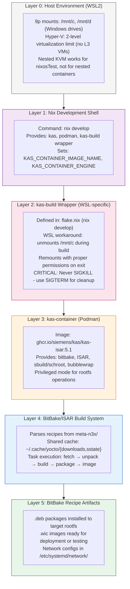

# Debian Backend for n3x

This directory contains the Debian backend for the n3x K3s cluster platform, using ISAR (Integration System for Automated Root filesystem generation) as the build framework.

**Architecture Diagram**: [n3x-debian-backend.drawio.svg](../../docs/diagrams/n3x-debian-backend.drawio.svg) — kas overlay composition, configuration hierarchy, build stack, artifact flow, and build matrix.
See also: [System Architecture](../../docs/diagrams/n3x-architecture.drawio.svg) | [NixOS Backend](../../docs/diagrams/n3x-nixos-backend.drawio.svg) | [CI Pipeline](../../docs/diagrams/ci-pipeline.drawio.svg)

## Build Architecture



## Directory Structure

```
backends/debian/
├── kas/                              # KAS configuration overlays
│   ├── base.yml                      # Base configuration (shared cache, container settings)
│   ├── machine/                      # Machine-specific overlays
│   │   ├── qemu-amd64.yml           # QEMU x86_64 (testing)
│   │   └── jetson-orin-nano.yml     # Jetson Orin Nano (hardware)
│   ├── image/                        # Image recipe overlays
│   │   ├── k3s-server.yml           # K3s server image
│   │   └── k3s-agent.yml            # K3s agent image
│   ├── boot/                         # Bootloader overlays
│   │   ├── grub.yml                 # GRUB (for SWUpdate A/B OTA)
│   │   └── systemd-boot.yml         # systemd-boot (explicit override)
│   └── network/                      # Network profile overlays
│       ├── simple.yml               # Flat network (default)
│       ├── vlans.yml                # VLAN tagging
│       └── bonding-vlans.yml        # Bonding + VLANs
├── meta-n3x/                    # BitBake layer
│   ├── conf/layer.conf              # Layer configuration
│   ├── recipes-core/                # Core image recipes
│   │   └── images/                  # Image definitions
│   └── recipes-support/             # Support package recipes
│       ├── systemd-networkd-config/ # Network configuration (from Nix)
│       └── k3s/                     # K3s binary and service
├── build/                            # Build output (gitignored)
│   ├── tmp/deploy/images/           # Final images
│   ├── tmp/work/                    # Recipe workdirs
│   └── downloads/                   # Downloaded sources (link to cache)
└── README.md                         # This file
```

## Quick Start

### Prerequisites

1. **Podman** - Container engine (recommended over Docker for rootless support)
2. **KVM** - Kernel virtualization for qemu-amd64 testing
3. **WSL2** (if on Windows) - With nested virtualization enabled

### Build Commands

```bash
# Enter the Debian development shell
nix develop

# Build a K3s server image for QEMU (testing)
cd backends/debian
kas-build kas/base.yml:kas/machine/qemu-amd64.yml:kas/image/k3s-server.yml:kas/network/simple.yml

# Build for Jetson Orin Nano (hardware)
kas-build kas/base.yml:kas/machine/jetson-orin-nano.yml:kas/image/k3s-server.yml:kas/network/vlans.yml

# Build a specific package only (for debugging)
kas-build kas/base.yml:kas/machine/qemu-amd64.yml --cmd "bitbake systemd-networkd-config"
```

### Network Profiles

Network configurations are generated from Nix profiles to ensure parity with NixOS:

| Profile | Description | K3s Interface | Storage Interface |
|---------|-------------|---------------|-------------------|
| `simple` | Single flat network | eth1 (192.168.1.x/24) | Same |
| `vlans` | 802.1Q VLAN tagging | eth1.200 (192.168.200.x/24) | eth1.100 (192.168.100.x/24) |
| `bonding-vlans` | Bond + VLANs | bond0.200 | bond0.100 |

To regenerate network configs after modifying `lib/network/profiles/*.nix`:

```bash
nix run '.#generate-networkd-configs'
```

## Bootloader Configuration

ISAR images support two bootloaders with different capabilities:

| Bootloader | Default | Use Case | OTA Method |
|------------|---------|----------|------------|
| **systemd-boot** | ✓ Yes | Standard operation, fast boot, simple | systemd-sysupdate (future) |
| **GRUB** | No | A/B partition OTA with SWUpdate | grubenv variable switching |

### Default: systemd-boot

systemd-boot is the default bootloader for all k3s images (Plan 019 B8). Benefits:
- Simpler implementation (no scripting language)
- Better EFI integration
- Faster boot times
- Aligns with systemd ecosystem

No overlay needed for systemd-boot - it's the default:
```bash
# Default build uses systemd-boot
kas-build kas/base.yml:kas/machine/qemu-amd64.yml:kas/packages/k3s-core.yml:kas/packages/debug.yml:kas/image/k3s-server.yml:kas/network/simple.yml:kas/node/server-1.yml
```

### Alternative: GRUB for SWUpdate A/B OTA

GRUB is required for SWUpdate's A/B partition switching mechanism. Use `kas/boot/grub.yml`:
```bash
# Use GRUB for SWUpdate A/B OTA images
kas-build kas/base.yml:kas/machine/qemu-amd64.yml:kas/packages/k3s-core.yml:kas/packages/debug.yml:kas/image/k3s-server.yml:kas/boot/grub.yml:kas/feature/swupdate.yml:kas/network/simple.yml:kas/node/server-1.yml
```

### kas/boot/ Overlay Structure

```
kas/boot/
├── grub.yml           # Opt-in GRUB (overrides default systemd-boot)
└── systemd-boot.yml   # Explicit systemd-boot (override GRUB if needed)
```

| Overlay | Purpose | When to Use |
|---------|---------|-------------|
| `kas/boot/grub.yml` | Switch to GRUB | When using SWUpdate A/B OTA |
| `kas/boot/systemd-boot.yml` | Explicit systemd-boot | Override GRUB after swupdate.yml |

### Bootloader Build Examples

```bash
# 1. Standard build (systemd-boot default)
kas-build kas/base.yml:kas/machine/qemu-amd64.yml:kas/packages/k3s-core.yml:kas/packages/debug.yml:kas/image/k3s-server.yml:kas/network/simple.yml:kas/node/server-1.yml

# 2. SWUpdate A/B OTA with GRUB
kas-build kas/base.yml:kas/machine/qemu-amd64.yml:kas/packages/k3s-core.yml:kas/packages/debug.yml:kas/image/k3s-server.yml:kas/boot/grub.yml:kas/feature/swupdate.yml:kas/network/simple.yml:kas/node/server-1.yml

# 3. Override SWUpdate's GRUB back to systemd-boot (testing only)
kas-build kas/base.yml:kas/machine/qemu-amd64.yml:kas/packages/k3s-core.yml:kas/packages/debug.yml:kas/image/k3s-server.yml:kas/feature/swupdate.yml:kas/boot/systemd-boot.yml:kas/network/simple.yml:kas/node/server-1.yml
```

### Technical Details

**WKS files** (WIC Kickstart) control bootloader selection via the `--sourceparams` directive:

| Bootloader | WKS File | Key Parameter |
|------------|----------|---------------|
| systemd-boot | `sdimage-efi-systemd-boot-k3s.wks` | `loader=systemd-boot` |
| GRUB | `sdimage-efi-n3x.wks` | `loader=grub-efi` |

**Package requirements**:
- **systemd-boot**: `systemd-boot-efi` package in both imager chroot and target rootfs (handled by image recipes)
- **GRUB**: Built-in to ISAR imager, no explicit package needed

## N-Node Build Process (Plan 018)

Each node in the cluster requires a distinct image with the correct IP address baked in. This eliminates runtime IP workarounds and matches the NixOS backend's content-addressed architecture.

### Architecture

```
┌─────────────────────────────────────────────────────────────────────────────┐
│                      N-Node Image Architecture                               │
├─────────────────────────────────────────────────────────────────────────────┤
│                                                                             │
│  NixOS Backend:                                                             │
│    lib/network/profiles/${profile}.nix  ─┬─► server-1 VM derivation         │
│                                          ├─► server-2 VM derivation         │
│    (Different configs = different hashes  │   (IP baked in at eval time)   │
│     automatically via Nix evaluation)    └─► ...                            │
│                                                                             │
│  Debian Backend:                                                            │
│    kas/network/${profile}.yml  ─┬─► Build with kas/node/server-1.yml       │
│                                 │    → Distinct .wic with 192.168.x.1      │
│    kas/node/${node}.yml        ─┼─► Build with kas/node/server-2.yml       │
│                                 │    → Distinct .wic with 192.168.x.2      │
│    (Each build produces unique  └─► Register hashes via isar-build-all     │
│     content-addressed artifact)                                             │
│                                                                             │
└─────────────────────────────────────────────────────────────────────────────┘
```

### Build Command Structure

```bash
# Full build command structure (all overlays required):
kas-build kas/base.yml:kas/machine/<MACHINE>.yml:kas/packages/k3s-core.yml:kas/packages/debug.yml:kas/image/<ROLE>.yml:kas/test-k3s-overlay.yml:kas/network/<PROFILE>.yml:kas/node/<NODE>.yml

# Where:
#   <MACHINE>  = qemu-amd64, jetson-orin-nano, amd-v3c18i
#   <ROLE>     = k3s-server, k3s-agent
#   <PROFILE>  = simple, vlans, bonding-vlans
#   <NODE>     = server-1, server-2, agent-1, agent-2, etc.
```

**CRITICAL**: The `kas/packages/k3s-core.yml` and `kas/packages/debug.yml` overlays are REQUIRED. Package lists were moved from BitBake recipes to kas overlays in Plan 018 R2.

### Build Commands Reference

#### Simple Profile (flat network on eth1)

| Node | IP Address | Build Command |
|------|------------|---------------|
| server-1 | 192.168.1.1/24 | `kas-build kas/base.yml:kas/machine/qemu-amd64.yml:kas/packages/k3s-core.yml:kas/packages/debug.yml:kas/image/k3s-server.yml:kas/test-k3s-overlay.yml:kas/network/simple.yml:kas/node/server-1.yml` |
| server-2 | 192.168.1.2/24 | `kas-build kas/base.yml:kas/machine/qemu-amd64.yml:kas/packages/k3s-core.yml:kas/packages/debug.yml:kas/image/k3s-server.yml:kas/test-k3s-overlay.yml:kas/network/simple.yml:kas/node/server-2.yml` |

#### VLANs Profile (802.1Q tagging on eth1)

| Node | Cluster IP (VLAN 200) | Storage IP (VLAN 100) | Build Command |
|------|----------------------|----------------------|---------------|
| server-1 | 192.168.200.1/24 | 192.168.100.1/24 | `kas-build kas/base.yml:kas/machine/qemu-amd64.yml:kas/packages/k3s-core.yml:kas/packages/debug.yml:kas/image/k3s-server.yml:kas/test-k3s-overlay.yml:kas/network/vlans.yml:kas/node/server-1.yml` |
| server-2 | 192.168.200.2/24 | 192.168.100.2/24 | `kas-build kas/base.yml:kas/machine/qemu-amd64.yml:kas/packages/k3s-core.yml:kas/packages/debug.yml:kas/image/k3s-server.yml:kas/test-k3s-overlay.yml:kas/network/vlans.yml:kas/node/server-2.yml` |

#### Bonding+VLANs Profile (bond0 with 802.1Q tagging)

| Node | Cluster IP (VLAN 200) | Storage IP (VLAN 100) | Build Command |
|------|----------------------|----------------------|---------------|
| server-1 | 192.168.200.1/24 | 192.168.100.1/24 | `kas-build kas/base.yml:kas/machine/qemu-amd64.yml:kas/packages/k3s-core.yml:kas/packages/debug.yml:kas/image/k3s-server.yml:kas/test-k3s-overlay.yml:kas/network/bonding-vlans.yml:kas/node/server-1.yml` |
| server-2 | 192.168.200.2/24 | 192.168.100.2/24 | `kas-build kas/base.yml:kas/machine/qemu-amd64.yml:kas/packages/k3s-core.yml:kas/packages/debug.yml:kas/image/k3s-server.yml:kas/test-k3s-overlay.yml:kas/network/bonding-vlans.yml:kas/node/server-2.yml` |

### Build and Register Workflow

The `isar-build-all` flake app automates the full lifecycle: build → rename to unique filename → hash → add to nix store → update `lib/debian/artifact-hashes.nix`.

```bash
# Build ALL variants, register all artifacts
nix run '.#isar-build-all'

# Build one specific variant
nix run '.#isar-build-all' -- --variant server-simple-server-2

# Build all variants for one machine
nix run '.#isar-build-all' -- --machine qemuamd64

# List all variants in the matrix
nix run '.#isar-build-all' -- --list

# Preview what would be built (no execution)
nix run '.#isar-build-all' -- --dry-run

# After building, stage and verify
git add lib/debian/artifact-hashes.nix
nix flake check --no-build
nix eval '.#debianArtifacts.qemuamd64.server.simple."server-2".wic.name'
```

Variant definitions, naming functions, and kas command generation live in `lib/debian/build-matrix.nix`. The only file modified by the build script is `lib/debian/artifact-hashes.nix`.

### Artifact Registry Access Patterns

```nix
# Node-specific access (Plan 018 recommended):
debianArtifacts.qemuamd64.server.simple."server-1".wic
debianArtifacts.qemuamd64.server.simple."server-2".wic
debianArtifacts.qemuamd64.server.vlans."server-1".wic
debianArtifacts.qemuamd64.server.vlans."server-2".wic
debianArtifacts.qemuamd64.server.bonding-vlans."server-1".wic
debianArtifacts.qemuamd64.server.bonding-vlans."server-2".wic

# Legacy access (backwards compatibility - defaults to server-1):
debianArtifacts.qemuamd64.server.simple.wic      # same as ."server-1".wic
debianArtifacts.qemuamd64.server.vlans.wic       # same as ."server-1".wic
debianArtifacts.qemuamd64.server.wic             # same as .simple."server-1".wic
```

### Adding New Nodes

To add a new node (e.g., `server-3`):

1. **Create node overlay**: `kas/node/server-3.yml`
   ```yaml
   header:
     version: 14

   local_conf_header:
     node-identity: |
       NETWORKD_NODE_NAME = "server-3"
   ```

2. **Create network config files**: Add to `meta-n3x/recipes-support/systemd-networkd-config/files/<profile>/server-3/`:
   - Copy from existing node, update IP addresses

3. **Build the image**: Use build command with `:kas/node/server-3.yml`

4. **Build and register**: `nix run '.#isar-build-all' -- --variant <id>`

5. **Update test**: Modify `mk-debian-cluster-test.nix` to use new node if needed

### Current Build Matrix

| Profile | server-1 | server-2 | Test Status |
|---------|----------|----------|-------------|
| simple | ✓ Built | ✓ Built | PASS |
| vlans | ✓ Built | ✓ Built | PASS |
| bonding-vlans | ✓ Built | ✓ Built | k3s issue (network OK) |

## WSL2 Considerations

### The sgdisk sync() Bug

When building WIC images, `sgdisk` calls `sync()` which hangs on WSL2's 9p filesystem mounts. The `kas-build` wrapper handles this by:

1. Unmounting `/mnt/c` (and other Windows drives) before build
2. Running the build in the container
3. Remounting with proper permissions on exit

**CRITICAL**: Never use `kill -9` on a running `kas-build` process! This prevents the cleanup handler from remounting filesystems. Instead:

```bash
# Preferred: graceful termination
kill -TERM <pid>
sleep 5

# If still running
kill -INT <pid>
sleep 3

# Last resort only (breaks mounts!)
kill -9 <pid>

# Recovery after SIGKILL
nix run '.#wsl-remount'
# Or from PowerShell: wsl --shutdown
```

### Shared Cache Configuration

Build artifacts are cached at the user level to persist across projects:

```yaml
# In kas/base.yml
local_conf_header:
  shared-cache: |
    DL_DIR = "${HOME}/.cache/yocto/downloads"
    SSTATE_DIR = "${HOME}/.cache/yocto/sstate"
```

Verify cache is working:
```bash
ls -la ~/.cache/yocto/
# Should show downloads/ and sstate/ directories
```

## Troubleshooting

### Check for Orphaned Processes

```bash
# Check for running containers
sudo podman ps -a

# Check for build processes
pgrep -a bitbake
pgrep -a kas

# Clean up orphaned containers
sudo podman rm -f $(sudo podman ps -aq)
```

### Recipe Debugging

```bash
# Enter Debian development shell to debug
nix develop
cd backends/debian

# Clean and rebuild a specific recipe
kas-build kas/base.yml:kas/machine/qemu-amd64.yml --cmd "bitbake -c cleanall systemd-networkd-config"
kas-build kas/base.yml:kas/machine/qemu-amd64.yml --cmd "bitbake systemd-networkd-config"

# Check package contents
dpkg-deb -c build/tmp/work/*/systemd-networkd-config/*/systemd-networkd-config_*.deb
```

### Common Issues

| Issue | Cause | Solution |
|-------|-------|----------|
| `bwrap: not found` | Wrong container image | Use `kas-isar:5.1`, not `kas:latest` |
| Build hangs at 96% | sgdisk sync() on 9p | Use `kas-build` wrapper (unmounts /mnt/c) |
| `/mnt/c` empty after build | SIGKILL killed wrapper | Run `nix run '.#wsl-remount'` |
| `sysconfdir` undefined | ISAR vs OE difference | Already fixed - ensure latest recipe |
| sstate not reused | Wrong cache path | Check `~/.cache/yocto/` exists |

## Configuration Hierarchy: Where to Configure What

Understanding the abstraction layers helps decide WHERE to make configuration changes:

```
┌─────────────────────────────────────────────────────────────────────────────────┐
│              Configuration Abstraction Hierarchy (Top to Bottom)                │
├─────────────────────────────────────────────────────────────────────────────────┤
│                                                                                 │
│  ┌─────────────────────────────────────────────────────────────────────────┐   │
│  │ LAYER A: Nix Derivation (Highest - Orchestration)                       │   │
│  │   WHERE: flake.nix, lib/debian/{build-matrix,artifact-hashes,mk-artifact-registry}.nix │
│  │   ROLE: Build orchestration, artifact references, test integration      │   │
│  │   CHANGES: Which kas files to combine, output paths, test dependencies  │   │
│  │   EXAMPLE: packages.x86_64-linux.debian-qemu-amd64-server-simple         │   │
│  └─────────────────────────────────────────────────────────────────────────┘   │
│                              │ invokes                                         │
│                              ▼                                                 │
│  ┌─────────────────────────────────────────────────────────────────────────┐   │
│  │ LAYER B: kas YAML Overlays (Configuration & Parameterization)           │   │
│  │   WHERE: backends/debian/kas/*.yml                                      │   │
│  │   ROLE: Configure builds WITHOUT touching BitBake recipes               │   │
│  │   CHANGES: IMAGE_INSTALL, target images, BitBake variables, profiles    │   │
│  │   WHAT IT CAN DO:                                                       │   │
│  │     • Add/remove Debian packages: IMAGE_INSTALL:append = " pkg"         │   │
│  │     • Set recipe variables: NETWORKD_PROFILE = "vlans"                  │   │
│  │     • Override targets: target: n3x-image-server                   │   │
│  │     • Include layers: repos: { ... }                                    │   │
│  │   WHAT IT CANNOT DO:                                                    │   │
│  │     • Create new recipes (need .bb files)                               │   │
│  │     • Change recipe logic (fetch/compile/install steps)                 │   │
│  │     • Add new systemd services without a recipe                         │   │
│  └─────────────────────────────────────────────────────────────────────────┘   │
│                              │ configures                                      │
│                              ▼                                                 │
│  ┌─────────────────────────────────────────────────────────────────────────┐   │
│  │ LAYER C: BitBake Recipes (Implementation)                               │   │
│  │   WHERE: backends/debian/meta-n3x/recipes-*/*.bb                   │   │
│  │   ROLE: Define HOW to build packages/images                             │   │
│  │   CHANGES: Fetch URLs, compile steps, install paths, file contents      │   │
│  │   MODIFY WHEN:                                                          │   │
│  │     • Adding new custom packages (need a .bb recipe)                    │   │
│  │     • Complex build logic that kas vars can't express                   │   │
│  │     • Upstream package modifications (.bbappend)                        │   │
│  └─────────────────────────────────────────────────────────────────────────┘   │
│                                                                                 │
└─────────────────────────────────────────────────────────────────────────────────┘
```

### Decision Tree: Where to Make Changes

```
Need to configure an ISAR image?
│
├─> Adding a standard Debian package?
│   └─> kas overlay: IMAGE_INSTALL:append = " package-name"
│       Example: kas/feature/monitoring.yml adds " prometheus-node-exporter"
│
├─> Changing network profile or node identity?
│   └─> kas overlay: NETWORKD_PROFILE, NETWORKD_NODE_NAME
│       Example: kas/network/vlans.yml sets NETWORKD_PROFILE = "vlans"
│
├─> Selecting image type (server vs agent)?
│   └─> kas overlay: target: n3x-image-{server,agent}
│       Example: kas/image/k3s-server.yml vs kas/image/k3s-agent.yml
│
├─> Enabling a build feature (debug, SDK)?
│   └─> kas overlay: specific variables for that feature
│       Example: kas/opt/debug.yml enables debug symbols
│
├─> Adding a new custom service/package?
│   └─> BitBake recipe (.bb) in meta-n3x/
│       Then include via kas overlay: IMAGE_INSTALL:append
│
├─> Modifying an existing ISAR/Debian package?
│   └─> BitBake .bbappend file
│       This is advanced and rarely needed
│
└─> Orchestrating from Nix (tests, artifacts)?
    └─> Nix derivation calling kas-container
```

### kas Overlay Capabilities

kas overlays can configure nearly everything through BitBake variables:

| Configuration Type | kas Variable | Example |
|-------------------|--------------|---------|
| Add Debian packages | `IMAGE_INSTALL:append` | `" vim htop"` |
| Set recipe variables | Any `VAR_NAME` | `NETWORKD_NODE_NAME = "server-2"` |
| Change target image | `target:` | `n3x-image-agent` |
| Add repository | `repos:` section | External meta-layers |
| Set machine | `machine:` | `qemu-amd64` |
| Set distro | `distro:` | `debian-bookworm` |
| Build parallelism | `BB_NUMBER_THREADS` | `"8"` |
| Debug verbosity | `BUILDHISTORY_COMMIT` | `"1"` |

**Key insight**: Your team adding Debian packages for userspace applications should use kas overlays, NOT modify BitBake recipes. Create feature overlays like:

```yaml
# kas/feature/my-app.yml
header:
  version: 14

local_conf_header:
  my-app: |
    IMAGE_INSTALL:append = " my-debian-package another-package"
```

Then compose: `kas/base.yml:kas/machine/qemu-amd64.yml:kas/image/k3s-server.yml:kas/feature/my-app.yml`

## Integration with Nix

The Debian backend integrates with the main n3x flake:

- **Network configs**: Generated from `lib/network/profiles/*.nix`
- **Test images**: Registered via `lib/debian/artifact-hashes.nix`, consumed by generated artifact registry for nixosTest
- **Flash scripts**: Use `lib.mkJetsonFlashScript` for hardware deployment

See `lib/network/README.md` for the unified network abstraction design.

## See Also

- [BSP-GUIDE.md](BSP-GUIDE.md) — BSP development (Level 1): Machine configs, vendor packages, cross-build
- [NVIDIA Out-of-Tree Kernel Modules](meta-n3x/recipes-kernel/nvidia-oot/README.md) — Jetson OOT kernel module recipes
- [packages/README.md](packages/README.md) — Application packages (Level 0): Debian packaging workflow
- [../../tests/README.md](../../tests/README.md) — Test infrastructure: L1-L4 test progression
- [An Excellent Video Explanation on ISAR and Embedded Linux](https://youtu.be/j5OqhlvZGTE?si=6mpKYIy1-BMkKpQY)
- [Presentation Slides on ISAR](https://opensource.siemens.com/meetups/2025isar/slides/02_Isar-Embedded-Debian-Development-2025_Baurzhan.pdf)
- [Generating SBoMs with ISAR](https://opensource.siemens.io/meetups/2025isar/slides/08_Generating-SBOMs-With-isar_Steiger_Moessbauer.pdf)
- [Industrial Grade Linux with ISAR](https://opensource.siemens.io/meetups/2025isar/slides/06_Industrial-Grade-Linux-with-Isar_Schwing.pdf)
- 
