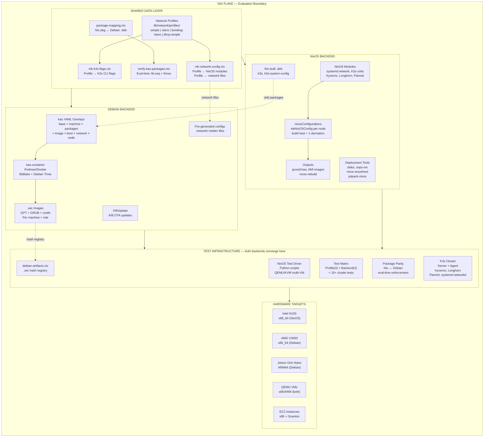
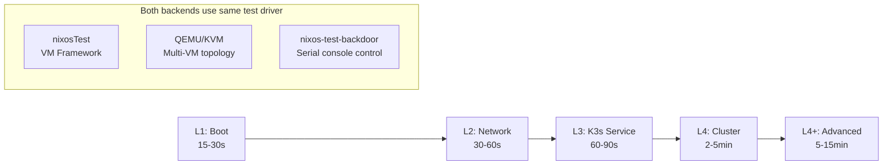
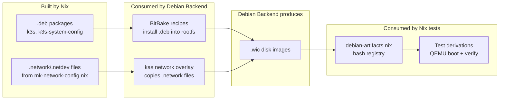

# n3x System Architecture

Architecture diagrams for the n3x declarative K3s cluster framework.
Rich editing version: [`n3x-architecture.drawio.svg`](n3x-architecture.drawio.svg) (open in DrawIO desktop).

## System Architecture

The Nix flake is the outermost evaluation boundary. Everything — both backends,
all tests, all verification — is instantiated by `nix flake check` / `nix build`.

## Test Layer Progression

## Cross-Backend Artifact Flow

Invisible in most diagrams but architecturally critical:

## Eval-Time Verification

`nix flake check --no-build` catches errors before any build:

| Check | Mechanism | Catches |
|-------|-----------|---------|
| Package parity | `lib.seq` + `throw` | Missing Debian packages in kas overlays |
| Module types | NixOS module system | Invalid config values, missing options |
| Derivation inputs | Nix evaluator | Missing files, broken references |

This is a fundamental Nix property, not CI-specific. Works identically
on a developer laptop and in a CI pipeline.

## Component Responsibilities

| Layer | Component | Responsibility |
|-------|-----------|----------------|
| **Shared Data** | Network Profiles | Pure data: IPs, interfaces, VLANs, bonds |
| **Shared Data** | mk-network-config.nix | Profile → NixOS modules or .network files |
| **Shared Data** | mk-k3s-flags.nix | Profile → K3s server/agent CLI flags |
| **Shared Data** | package-mapping.nix | Nix ↔ Debian package name mapping |
| **Shared Data** | verify-kas-packages.nix | Eval-time parity enforcement |
| **NixOS** | NixOS Modules | Declarative host config (network, K3s, add-ons) |
| **NixOS** | nixosConfigurations | Per-node configs, build+test = 1 derivation |
| **NixOS** | Deployment tools | disko, sops-nix, nixos-anywhere, jetpack-nixos |
| **NixOS** | Nix-built .deb | k3s binary + system config as Debian packages |
| **Debian** | kas YAML overlays | Compositional build parameterization |
| **Debian** | kas-container | Containerized BitBake execution |
| **Debian** | .wic images | Bootable disk images per machine × role |
| **Debian** | SWUpdate | A/B partition OTA updates |
| **Test** | NixOS Test Driver | Python-scripted multi-VM integration tests |
| **Test** | debian-artifacts.nix | .wic hash registry for Debian test derivations |
| **Test** | Package Parity | Nix ↔ Debian equivalence verification |
| **Hardware** | Intel N100 | x86_64 cluster nodes (NixOS) |
| **Hardware** | AMD V3000 | x86_64 edge compute (Debian) |
| **Hardware** | Jetson Orin Nano | ARM64 edge compute (Debian) |
| **Hardware** | EC2 Instances | x86 + Graviton CI runners (NixOS) |

## Key Design Principles

1. **Nix Flake as Container**: The flake evaluation boundary encompasses all builds, tests, and verification
2. **Shared Data Layer**: Both backends consume the same profiles through the same transformation functions
3. **Dual Backend Architecture**: NixOS and Debian (ISAR) as parallel backends — same abstractions, different build systems
4. **Cross-Backend Artifacts**: Nix builds .deb packages and generates network configs consumed by the Debian backend
5. **Test Convergence**: Both backends are VM-tested using the same NixOS test driver and QEMU/KVM
6. **Eval-Time Verification**: `nix flake check --no-build` catches configuration errors before any build starts
7. **Declarative Everything**: Network, disk, K3s config all generated from pure data profiles

## Related Diagrams

- **Debian Backend**: [`n3x-debian-backend.drawio.svg`](n3x-debian-backend.drawio.svg) — kas overlay composition, build stack, configuration hierarchy
- **NixOS Backend**: [`n3x-nixos-backend.drawio.svg`](n3x-nixos-backend.drawio.svg) — module composition, deployment paths, flake inputs
- **CI Pipeline**: [`ci-pipeline.drawio.svg`](ci-pipeline.drawio.svg) — GitLab stages, runner infrastructure, cache mesh
- **Build & Caching**: [`build-caching.drawio.svg`](build-caching.drawio.svg) — build pipeline, cache topology, Harmonia
