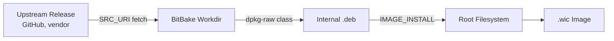
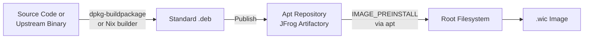
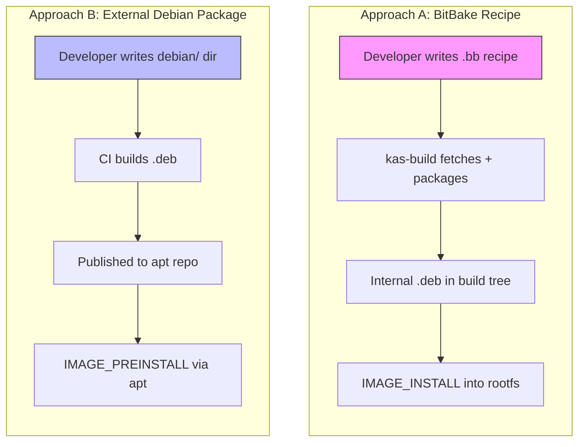
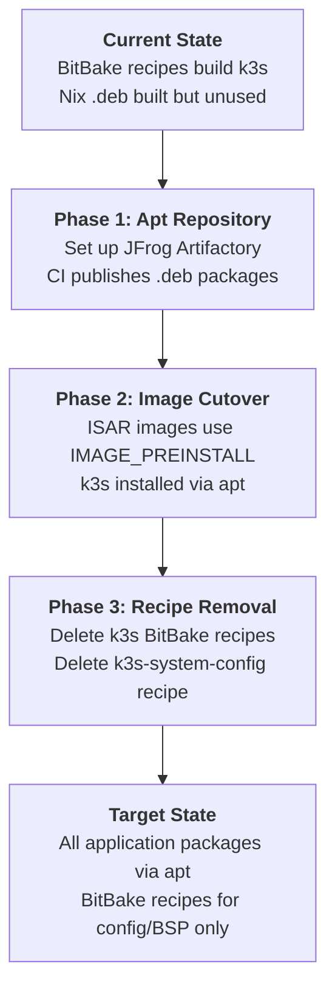

# Package Integration Approaches for ISAR Images

This document compares two approaches to integrating custom software into ISAR-built Debian images, documents the current transitional state, and outlines the migration path to a unified model.

## Background

n3x builds production Debian images using ISAR (Integration System for Automated Root filesystem generation). Custom software — binaries, services, configuration — must be packaged and installed into these images. Two fundamentally different approaches exist for this, and both are currently in use.

## Approach A: BitBake Recipe (In-Tree)

Software is fetched, packaged, and installed entirely within the ISAR/BitBake build system.

**How it works**: A BitBake recipe (`.bb` file) in `meta-n3x/` defines how to download a binary or compile source, create a `.deb` package internally, and install it into the image via `IMAGE_INSTALL`.

**Flow**:

**Current examples**:
- `k3s-server` / `k3s-agent` — downloads k3s binary from GitHub, installs with systemd units
- `k3s-system-config` — kernel modules, sysctl, iptables config
- `swupdate-config` — SWUpdate configuration files (binary pulled from Debian repos via `DEBIAN_DEPENDS`)
- `systemd-networkd-config` — Nix-generated `.network`/`.netdev` files
- `gptfdisk-wsl-fix` — WSL2 workaround (compiles `nosync.so` from source)

**Characteristics**:

| Aspect | Detail |
|--------|--------|
| Build tool | BitBake (via kas-container) |
| Package format | Internal .deb (never published) |
| Versioning | Recipe filename (`k3s-server_1.35.0.bb`) |
| Checksum | Optional (`BB_STRICT_CHECKSUM`) |
| Quality checks | None (ISAR disables lintian/autopkgtest) |
| Who can modify | Developers with BitBake/ISAR knowledge |
| External infra | None required |

**Strengths**:
- Self-contained: no external infrastructure needed
- Familiar to Yocto/ISAR practitioners
- Direct control over installation paths and systemd integration
- Works offline after initial download

**Weaknesses**:
- Requires BitBake knowledge (steep learning curve)
- No standard Debian quality tooling (lintian, autopkgtest, piuparts)
- Packages exist only inside ISAR builds — not reusable outside
- No shared artifact cache between developers
- Version management is manual (edit recipe filename + variables)

## Approach B: External Debian Package (Standard Packaging)

Software is built as a standard Debian package outside ISAR, published to an apt repository, and consumed by ISAR images via standard `apt-get install`.

**How it works**: A standard `debian/` directory defines the package using Debian Policy conventions. The package is built with `dpkg-buildpackage` (or a Nix wrapper), published to an apt repository, and ISAR images install it via `IMAGE_PREINSTALL`.

**Flow**:

**Current examples**:
- `packages/k3s/` — Nix-built unified k3s package (server + agent, neither enabled by default)
- `packages/k3s-system-config/` — Nix-built kernel/sysctl config package

**Future state** (after JFrog apt repository):
- All application packages follow this approach
- ISAR images consume via `IMAGE_PREINSTALL` in kas overlays

**Characteristics**:

| Aspect | Detail |
|--------|--------|
| Build tool | dpkg-buildpackage (via Nix wrapper) |
| Package format | Standard .deb (publishable) |
| Versioning | `debian/changelog` (standard) |
| Checksum | SHA256 enforced (Nix `fetchurl`) |
| Quality checks | lintian, autopkgtest available |
| Who can modify | Any Debian developer |
| External infra | Apt repository required |

**Strengths**:
- Standard Debian tooling — widely understood, well-documented
- Packages are reusable: installable on any Debian system, not just ISAR images
- Full quality pipeline available (lintian, autopkgtest, piuparts)
- CI validates packages independently of image builds
- Version management follows Debian conventions (`debian/changelog`)
- SHA256 checksums enforced at build time

**Weaknesses**:
- Requires apt repository infrastructure (JFrog Artifactory or similar)
- Additional CI step to publish packages before image build
- Two-phase build: package first, then image
- Nix knowledge needed for the build wrapper (current implementation)

## Comparison Matrix

| Criterion | Approach A (BitBake) | Approach B (External .deb) |
|-----------|---------------------|---------------------------|
| Learning curve | BitBake/ISAR required | Standard Debian packaging |
| Team accessibility | Platform team only | Any developer |
| Build reproducibility | Weak (no checksums by default) | Strong (Nix + SHA256) |
| Package reusability | ISAR-only | Any Debian system |
| Quality tooling | None | lintian, autopkgtest |
| Infrastructure needed | None | Apt repository |
| Iteration speed | Slow (full ISAR build) | Fast (isolated package build) |
| Offline capability | Yes (after first fetch) | Requires apt repo access |

## Current State Inventory

The project currently uses both approaches in a transitional hybrid state:

### k3s (Kubernetes Runtime)

**BitBake recipes** (`meta-n3x/recipes-core/k3s/`):
- Two separate recipes: `k3s-server_1.35.0.bb`, `k3s-agent_1.35.0.bb`
- Downloads binary from GitHub via `SRC_URI`
- No checksum verification (`BB_STRICT_CHECKSUM = "0"`)
- Consumed by ISAR image builds today

**Nix-built .deb** (`packages/k3s/`):
- Unified package (both server + agent services, neither enabled)
- Version 1.35.0+k3s3 with SHA256 checksums
- Validated by CI (Tier 2: `pkg-debian-x86_64`, `pkg-debian-aarch64`)
- NOT consumed by ISAR builds — awaiting apt repository

### swupdate-config (OTA Updates)

- **BitBake recipe only** (`meta-n3x/recipes-core/swupdate/`)
- Exemplar of the correct Debian-only model: installs configuration files, pulls the `swupdate` binary from Debian repositories via `DEBIAN_DEPENDS`
- No Nix .deb equivalent (not needed — binary comes from Debian)

### k3s-system-config (Kernel/System Tuning)

- **BitBake recipe** (`meta-n3x/recipes-core/k3s-system-config/`)
- **Nix-built .deb** (`packages/k3s-system-config/`)
- Duplicated across both systems (identical content)

### systemd-networkd-config (Network Configuration)

- **BitBake recipe only** (`meta-n3x/recipes-support/systemd-networkd-config/`)
- Installs Nix-generated `.network`/`.netdev` files
- Config-only package — not a candidate for external packaging

### Other Recipes (Infrastructure/BSP)

These are correctly placed as BitBake recipes and should remain so:

- `gptfdisk-wsl-fix` — WSL2-specific build workaround
- `nvidia-l4t-core/tools` — Jetson BSP packages
- `linux-tegra` — Custom kernel for Jetson Orin Nano
- `nixos-test-backdoor` — Test infrastructure only

## Migration Path

### Phase 1: Apt Repository Setup

- Deploy JFrog Artifactory (or equivalent) with Debian repository support
- Configure CI to build and publish `.deb` packages on merge to main
- Validate package installation on a test Debian system (outside ISAR)

### Phase 2: Image Cutover

- Add JFrog repository as an apt source in ISAR images (kas overlay)
- Switch k3s installation from `IMAGE_INSTALL` to `IMAGE_PREINSTALL`
- Run full test matrix to validate identical behavior
- Switch k3s-system-config similarly

### Phase 3: Recipe Removal

- Remove `k3s-server_*.bb`, `k3s-agent_*.bb`, and `k3s-base.inc` from `meta-n3x/`
- Remove `k3s-system-config_*.bb` from `meta-n3x/`
- Update kas overlays to reference packages by name only (no recipe dependency)

### Target State

After migration, `meta-n3x/` contains only:
- **Image recipes** (`recipes-core/images/`) — define what goes in each image
- **Config recipes** (`swupdate-config`, `systemd-networkd-config`) — deploy configuration files
- **BSP recipes** (`nvidia-l4t`, `linux-tegra`) — hardware-specific packages
- **Infrastructure** (`gptfdisk-wsl-fix`, `nixos-test-backdoor`) — build/test support

All application software (k3s, future services) comes from the apt repository.

## Recommendations

### Which approach for which package?

| Package Type | Approach | Rationale |
|-------------|----------|-----------|
| Application binaries (k3s, custom services) | **B** (External .deb) | Reusable, standard tooling, CI-validated |
| Configuration files (swupdate, networkd) | **A** (BitBake recipe) | Tightly coupled to image, no reuse value |
| BSP/kernel packages (nvidia-l4t, linux-tegra) | **A** (BitBake recipe) | Hardware-specific, ISAR cross-compile needed |
| Build workarounds (gptfdisk-wsl-fix) | **A** (BitBake recipe) | Build-time only, not a distributable package |
| Test infrastructure (nixos-test-backdoor) | **A** (BitBake recipe) | Test-only, never in production images |

### Decision Framework

Use **Approach B** (external .deb) when:
- The package is an application or service that could run on any Debian system
- Multiple teams need to modify or version the software independently
- You want standard Debian quality checks (lintian, autopkgtest)
- The package changes frequently and benefits from fast iteration cycles

Use **Approach A** (BitBake recipe) when:
- The package is configuration that's tightly coupled to the image build
- The package requires ISAR cross-compilation infrastructure (BSP, kernels)
- The package is build-time infrastructure (not in production images)
- No external apt repository is available yet (transitional)
