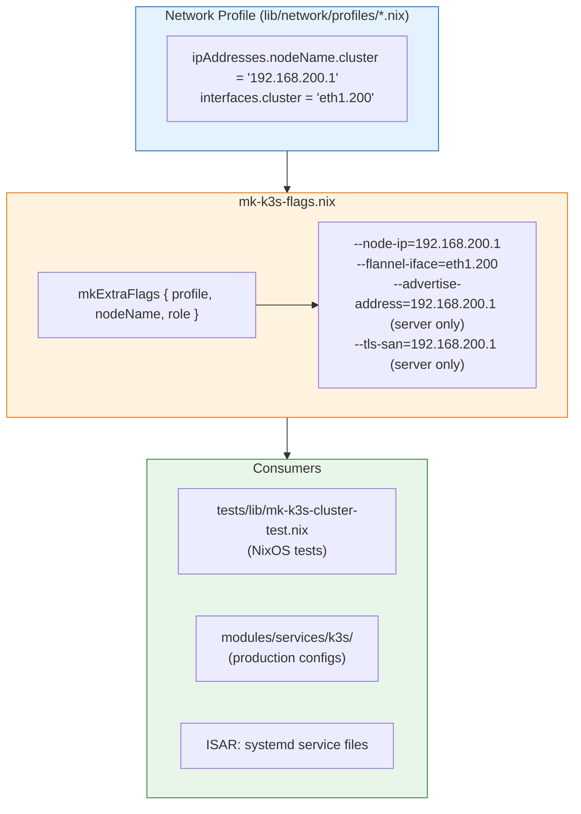

# lib/k3s/ - K3s Configuration Module

This directory contains shared K3s configuration generators used by both NixOS and ISAR backends.

## Why This Exists

K3s requires specific command-line flags based on network topology:
- `--node-ip` - IP address for node communication
- `--flannel-iface` - Interface for flannel overlay network
- `--advertise-address` - Server API advertisement (servers only)
- `--tls-san` - TLS Subject Alternative Names (servers only)

Previously, each network profile duplicated this logic. Now, `mk-k3s-flags.nix` generates flags from profile data.

## Architecture



## Usage

### In NixOS Test Builder

```nix
{ lib, ... }:
let
  mkK3sFlags = import ../../lib/k3s/mk-k3s-flags.nix { inherit lib; };
  profile = import ../../lib/network/profiles/vlans.nix { inherit lib; };
in
{
  services.k3s = {
    enable = true;
    role = "server";
    extraFlags = mkK3sFlags.mkExtraFlags {
      inherit profile;
      nodeName = "server-1";
      role = "server";
    };
  };
}
```

### In ISAR Backend

The same logic can be used to generate systemd unit file arguments:

```nix
# Generate flags for systemd ExecStart
let
  flags = mkK3sFlags.mkExtraFlags {
    inherit profile;
    nodeName = "server-1";
    role = "server";
  };
  flagString = lib.concatStringsSep " " flags;
in
"ExecStart=/usr/local/bin/k3s server ${flagString}"
```

## Parameters

### mkExtraFlags

| Parameter | Type | Required | Description |
|-----------|------|----------|-------------|
| `profile` | attrset | Yes | Network profile with `ipAddresses` and `interfaces` |
| `nodeName` | string | Yes | Node name (e.g., "server-1", "agent-1") |
| `role` | string | Yes | K3s role: "server" or "agent" |

### Profile Requirements

The profile must export:

```nix
{
  ipAddresses = {
    "server-1" = { cluster = "192.168.200.1"; };
    "agent-1" = { cluster = "192.168.200.3"; };
    # ...
  };
  interfaces = {
    cluster = "eth1.200";  # or "eth1" for flat network
  };
}
```

## Generated Flags

### All Nodes (server and agent)

| Flag | Value Source | Purpose |
|------|--------------|---------|
| `--node-ip` | `profile.ipAddresses.${nodeName}.cluster` | Node's cluster network IP |
| `--flannel-iface` | `profile.interfaces.cluster` | Interface for flannel VXLAN |

### Server Nodes Only

| Flag | Value Source | Purpose |
|------|--------------|---------|
| `--advertise-address` | `profile.ipAddresses.${nodeName}.cluster` | API server advertisement |
| `--tls-san` | `profile.ipAddresses."server-1".cluster` | TLS SAN for primary server |

## Examples

### Flat Network (simple profile)

```nix
mkExtraFlags {
  profile = { ipAddresses."server-1".cluster = "192.168.1.1"; interfaces.cluster = "eth1"; };
  nodeName = "server-1";
  role = "server";
}
# Returns: ["--node-ip=192.168.1.1" "--flannel-iface=eth1" "--advertise-address=192.168.1.1" "--tls-san=192.168.1.1"]
```

### VLAN Network

```nix
mkExtraFlags {
  profile = { ipAddresses."server-1".cluster = "192.168.200.1"; interfaces.cluster = "eth1.200"; };
  nodeName = "server-1";
  role = "server";
}
# Returns: ["--node-ip=192.168.200.1" "--flannel-iface=eth1.200" "--advertise-address=192.168.200.1" "--tls-san=192.168.200.1"]
```

### Agent Node

```nix
mkExtraFlags {
  profile = { ipAddresses."agent-1".cluster = "192.168.200.3"; interfaces.cluster = "eth1.200"; };
  nodeName = "agent-1";
  role = "agent";
}
# Returns: ["--node-ip=192.168.200.3" "--flannel-iface=eth1.200"]
# Note: No --advertise-address or --tls-san for agents
```

## See Also

- [Network Configuration Module](../network/README.md) — Unified network profiles and config generators consumed by this module

## Migration History

- **2026-01-27 (Plan 012, R5-R6)**: Created as part of unified network architecture
  - Extracted from duplicated logic in network profiles
  - Profiles now export data only, this module generates flags
  - Eliminates ~30 lines of duplicate code per profile
