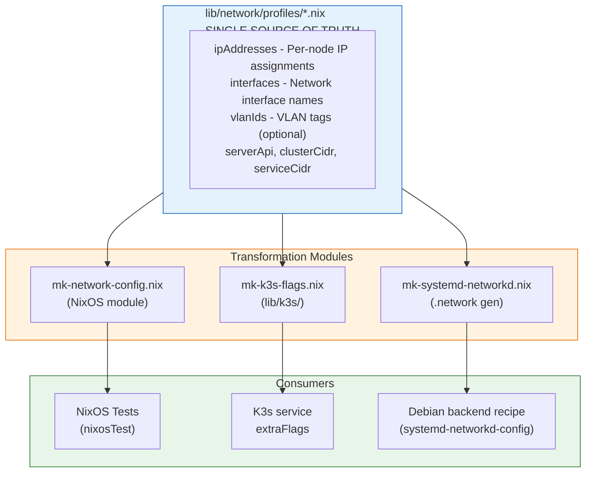

# lib/network/ - Unified Network Configuration

This directory contains the **single source of truth** for network configuration across all n3x backends (NixOS and Debian).

## Why This Exists

Previously, network configuration was duplicated:
- NixOS used `systemd.network.*` module options
- Debian backend used netplan YAML files in separate ISAR recipes

This created drift between backends. Now, network profiles define everything in one place, and each backend consumes them appropriately.

## Architecture Overview



## Directory Structure

```
lib/network/
├── profiles/                  # Network profile definitions
│   ├── simple.nix            # Single flat network (baseline)
│   ├── vlans.nix             # 802.1Q VLAN tagging
│   ├── bonding-vlans.nix     # Bonding + VLANs (production parity)
│   └── vlans-broken.nix      # Intentionally broken (negative testing)
├── mk-network-config.nix     # Generates NixOS module from profile
├── mk-systemd-networkd.nix   # Generates .network/.netdev file content
└── README.md                 # This file

lib/k3s/
├── mk-k3s-flags.nix          # Generates K3s extraFlags from profile
└── README.md                 # K3s module documentation
```

## Profile Schema

Each profile exports **data only** (no functions):

```nix
{
  # IP addresses per node per logical network
  ipAddresses = {
    "server-1" = { cluster = "192.168.200.1"; storage = "192.168.100.1"; };
    "server-2" = { cluster = "192.168.200.2"; storage = "192.168.100.2"; };
    ...
  };

  # Interface names (logical → actual)
  # VLAN interfaces include the VLAN suffix (e.g., "eth1.200")
  interfaces = {
    cluster = "eth1.200";    # K3s API, flannel, cluster traffic
    storage = "eth1.100";    # Longhorn, iSCSI, storage replication
  };

  # VLAN IDs (optional - only for profiles with VLANs)
  vlanIds = {
    cluster = 200;
    storage = 100;
  };

  # For backwards compatibility (legacy, used by some older tests)
  nodeIPs = { server-1 = "192.168.200.1"; ... };

  # K3s configuration
  serverApi = "https://192.168.200.1:6443";
  clusterCidr = "10.42.0.0/16";
  serviceCidr = "10.43.0.0/16";
}
```

**Note**: Profiles no longer export `nodeConfig` or `k3sExtraFlags` functions. These are now generated by separate modules:
- `mk-network-config.nix` generates NixOS configuration from profile data
- `lib/k3s/mk-k3s-flags.nix` generates K3s extra flags from profile data

This separation follows the DRY principle - profiles contain data, modules transform it.

## Backend Consumption

### NixOS Backend

Uses `mk-network-config.nix` to generate systemd-networkd configuration:

```nix
# In tests/lib/mk-k3s-cluster-test.nix
mkNetworkConfig = import ../../lib/network/mk-network-config.nix { inherit lib; };
profile = import ../../lib/network/profiles/vlans.nix { inherit lib; };

nodes.server-1 = { ... }:
  mkNetworkConfig.mkNodeNetworkConfig {
    inherit profile;
    nodeName = "server-1";
  };
```

K3s flags are generated using `lib/k3s/mk-k3s-flags.nix`:

```nix
mkK3sFlags = import ../../lib/k3s/mk-k3s-flags.nix { inherit lib; };
extraFlags = mkK3sFlags.mkExtraFlags {
  inherit profile;
  nodeName = "server-1";
  role = "server";
};
```

### Debian Backend

Uses `mk-systemd-networkd.nix` to generate `.network` and `.netdev` files:

```bash
# Generate config files from profiles
nix run '.#generate-networkd-configs'
```

Files are generated to `backends/debian/meta-n3x/recipes-support/systemd-networkd-config/files/<profile>/<node>/`.

The `systemd-networkd-config` recipe installs these to `/etc/systemd/network/` based on `NETWORKD_PROFILE` and `NETWORKD_NODE_NAME` variables.

```yaml
# In kas overlay
local_conf_header:
  network: |
    NETWORKD_PROFILE = "vlans"
    NETWORKD_NODE_NAME = "server-1"
```

## Adding a New Profile

1. Create `lib/network/profiles/myprofile.nix` with required exports:
   - `ipAddresses`, `interfaces`, `serverApi`, `clusterCidr`, `serviceCidr`
   - Optional: `vlanIds` (for VLAN profiles), `nodeIPs` (backwards compat)

2. Regenerate ISAR network config files:
   ```bash
   nix run '.#generate-networkd-configs'
   ```

3. Add test variant to `flake.nix` checks:
   ```nix
   k3s-cluster-myprofile = mkK3sClusterTest { networkProfile = "myprofile"; };
   ```

4. Test:
   ```bash
   nix build '.#checks.x86_64-linux.k3s-cluster-myprofile'
   ```

## See Also

- [K3s Configuration Module](../k3s/README.md) — Generates K3s command-line flags from network profile data

## Migration History

- **2026-01-27 (Plan 012)**: Major refactoring for unified architecture
  - Extracted `k3sExtraFlags` to `lib/k3s/mk-k3s-flags.nix`
  - Removed `nodeConfig` from profiles (now in `mk-network-config.nix`)
  - Profiles now export pure data, modules transform it
  - Debian backend uses `systemd-networkd-config` ISAR recipe (replaces netplan)
- **2026-01-26**: Moved from `tests/lib/network-profiles/` to `lib/network/profiles/`
  - This is IMAGE-BUILDING infrastructure, not test-specific
  - Both backends now consume from this unified location
