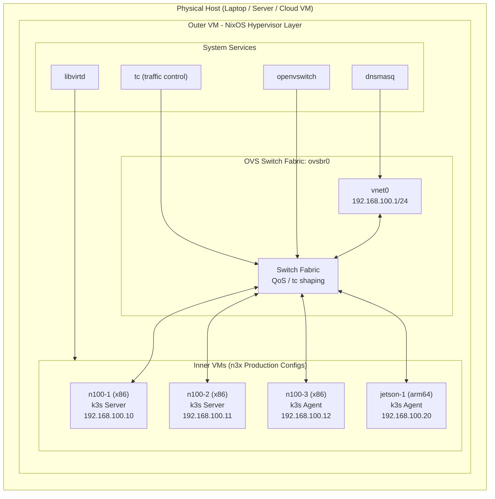

# n3x Emulation Testing Framework

**Status**: Operational (Session 12 - Headless Mode)
**Branch**: `main`
**Last Updated**: 2025-12-12
**Platform**: Native Linux only (see [Platform Compatibility](#platform-compatibility))

A declarative NixOS-based nested virtualization platform for testing n3x's production k3s cluster configurations before bare-metal deployment.

---

## Executive Summary

The emulation testing framework enables comprehensive validation of n3x deployments using nested virtualization. It provides:

- **Nested virtualization** - Run production n3x configs as libvirt VMs within a hypervisor VM
- **Network simulation** - OVS switch fabric with QoS, traffic control, and constraint profiles
- **ARM64 emulation** - Test Jetson configs via QEMU TCG on x86_64 hosts
- **Resource constraints** - Validate behavior under embedded system limits
- **Production parity** - Tests use actual n3x modules from `hosts/` and `modules/`

**Primary Use Case**: Test automation for k3s cluster deployments that require realistic multi-node simulation without cloud dependencies or physical hardware.

---

## Platform Compatibility

> **Important**: This emulation framework uses **nested virtualization** (VMs inside VMs).
> It requires a platform that supports at least 2 levels of virtualization depth.

### Platform Support Matrix

| Platform | Emulation Framework | Reason |
|----------|---------------------|--------|
| **Native Linux** (bare metal) | YES | Full KVM nested virtualization support |
| **Native Linux** (cloud VM with nested virt) | YES | Works on AWS metal instances, GCP with `--enable-nested-virtualization` |
| **WSL2** (Windows 10/11) | NO | Hyper-V Enlightened VMCS limits to 2 levels; inner VMs hang indefinitely |
| **Docker Desktop** | NO | No nested virtualization support |
| **macOS** (Intel) | PARTIAL | Requires VMware Fusion or Parallels with nested virt enabled |
| **macOS** (Apple Silicon) | NO | No nested x86_64 virtualization; ARM64-only via UTM/Virtualization.framework |

### Why WSL2 Doesn't Work

The emulation framework attempts 3-level nesting:
```
Hyper-V (L0) → WSL2 (L1) → Outer VM (L2) → Inner VMs (L3)
                                            ↑ BLOCKED
```

Hyper-V's Enlightened VMCS architecture does not support L3 guests:
- eVMCS v1 disables Shadow VMCS required for deeper nesting
- Microsoft's TLFS defines no L3 terminology—it stops at L2
- Inner VMs hang indefinitely with no boot output

See: [docs/hyper-v-enlightened-vmcs-caps-nested-virt-at-2-levels.md](../../docs/hyper-v-enlightened-vmcs-caps-nested-virt-at-2-levels.md)

### Recommended Alternatives

For k3s cluster testing on platforms without nested virtualization support:

1. **nixosTest multi-node** (Recommended for CI/CD)
   - Each nixosTest "node" IS a k3s cluster node—no inner VMs needed
   - Works on WSL2, Darwin, and cloud platforms
   - See: `tests/integration/k3s-*.nix`
   ```bash
   nix build '.#checks.x86_64-linux.k3s-cluster-formation'
   nix build '.#checks.x86_64-linux.k3s-storage'
   nix build '.#checks.x86_64-linux.k3s-network'
   ```

2. **Cloud-based testing**
   - Run tests on AWS metal instances (e.g., `c5.metal`, `i3.metal`)
   - Use GCP with nested virtualization enabled
   - GitLab CI with self-hosted KVM-enabled runners

3. **Native Linux workstation**
   - Dual-boot or dedicated Linux machine
   - Full nested virtualization support

### Verifying Your Platform

```bash
# Check if nested virtualization is available
cat /sys/module/kvm_intel/parameters/nested  # Intel: Y or 1
cat /sys/module/kvm_amd/parameters/nested    # AMD: 1

# On WSL2 (will show nested=1 but L3 still won't work due to eVMCS)
cat /sys/module/kvm_intel/parameters/nested  # Shows: Y
# However, L3 guests still hang—this is an architectural limitation

# Verify you're NOT in WSL2 before using emulation framework
if [ -n "$WSL_DISTRO_NAME" ]; then
  echo "WARNING: WSL2 detected. Emulation framework will NOT work."
  echo "Use nixosTest multi-node instead: nix build '.#checks.x86_64-linux.k3s-cluster-formation'"
fi
```

---

## Quick Start

### Prerequisites

Verify nested virtualization is enabled on your host:

```bash
# Intel CPUs
cat /sys/module/kvm_intel/parameters/nested
# Expected: Y or 1

# AMD CPUs
cat /sys/module/kvm_amd/parameters/nested
# Expected: 1

# Enable if needed (Intel example)
echo "options kvm_intel nested=1" | sudo tee /etc/modprobe.d/kvm-nested.conf
sudo modprobe -r kvm_intel && sudo modprobe kvm_intel
```

**System Requirements**:
- CPU with nested virtualization support (Intel VT-x/AMD-V)
- 16GB+ RAM recommended (outer VM uses 12GB by default)
- 60GB+ disk space for VM images and build artifacts

### Build and Run

```bash
# Build the emulation VM package
nix build .#packages.x86_64-linux.emulation-vm

# Option 1: Interactive mode (foreground, console on stdio)
./result/bin/run-nixos-vm

# Option 2: Background mode (daemon, connect via socat)
nix run .#emulation-vm-bg
# Then connect with: socat -,raw,echo=0 unix-connect:$XDG_RUNTIME_DIR/n3x-emulation/serial.sock

# Stop background VM
echo 'quit' | socat - unix-connect:$XDG_RUNTIME_DIR/n3x-emulation/monitor.sock
```

**Note**: The VM runs in **headless mode** (no graphics window). Serial console is available via stdio in interactive mode, or via Unix socket in background mode.

### Inside the Outer VM

```bash
# List all defined inner VMs
virsh list --all

# Start VMs
virsh start n100-1
virsh start n100-2
virsh start n100-3

# Start all VMs at once
for vm in n100-1 n100-2 n100-3; do virsh start $vm; done

# Access VM console (press Ctrl+] to exit)
virsh console n100-1

# View OVS switch topology
ovs-vsctl show

# Apply network constraints
/etc/tc-simulate-constraints.sh constrained
/etc/tc-simulate-constraints.sh lossy
/etc/tc-simulate-constraints.sh status
/etc/tc-simulate-constraints.sh default  # Remove constraints
```

---

## Architecture

### Nested Virtualization Structure

```
Physical Host (Laptop / Server / Cloud VM)
└── Outer VM (NixOS Hypervisor Layer - 12GB RAM, 8 vCPU)
    ├── libvirtd (VM management)
    ├── openvswitch (ovsbr0 bridge - simulates switch fabric)
    ├── dnsmasq (DHCP/DNS for inner VMs)
    ├── systemd-networkd (host interface: vnet0 @ 192.168.100.1/24)
    └── Inner VMs (n3x production configs):
        ├── n100-1 (x86_64)  - k3s Server - 192.168.100.10 (4GB, 2 vCPU) [KVM]
        ├── n100-2 (x86_64)  - k3s Server - 192.168.100.11 (4GB, 2 vCPU) [KVM]
        ├── n100-3 (x86_64)  - k3s Agent  - 192.168.100.12 (2GB, 2 vCPU, +10GB disk) [KVM]
        └── jetson-1 (arm64) - k3s Agent  - 192.168.100.20 (2GB, 2 vCPU) [TCG]
```

### Architecture Diagram



---

## When to Use Emulation Testing

### Testing Hierarchy

n3x uses a multi-layer testing approach. Choose the right layer for your needs:

| Layer | Tool | Speed | Use Case | Platforms |
|-------|------|-------|----------|-----------|
| **1. Fast Automated** | `nixosTest` multi-node | Seconds-Minutes | Multi-node k3s clusters, CI/CD, VLAN testing | All (WSL2, Darwin, Cloud) |
| **2. Emulation** | This framework (OVS + nested virt) | Minutes | Interactive testing, OVS topology visualization | Native Linux only |
| **3. Manual VMs** | `tests/vms/` | Minutes | Interactive debugging, exploration | All platforms |
| **4. Bare-metal** | Physical hardware | Hours | Final production validation | N/A |

### Use OVS Emulation Framework When You Need To:

1. **Interactive network testing** - SSH into VMs, run commands manually, explore behavior
2. **OVS topology visualization** - See switch fabric with `ovs-vsctl show`
3. **Test specific switch configurations** - Validate OpenFlow rules, VLAN trunk behavior
4. **ARM64 cross-architecture validation** - Test Jetson configs via QEMU TCG (very slow)
5. **Resource constraint scenarios** - Test behavior under extreme memory/CPU limits

**Platform Requirement**: Native Linux with KVM nested virtualization only.

### Use nixosTest Multi-Node For:

1. **Automated CI/CD testing** - Fast, reproducible, works on all platforms
2. **Multi-node k3s cluster validation** - 2+ servers, agents, cluster formation
3. **VLAN tagging testing** - Validate 802.1Q VLANs before hardware deployment
   ```bash
   nix build '.#checks.x86_64-linux.k3s-cluster-vlans'           # VLAN tagging
   nix build '.#checks.x86_64-linux.k3s-cluster-bonding-vlans'   # Bonding + VLANs
   ```
4. **Network constraints testing** - tc/netem directly on nodes (no OVS needed)
   ```bash
   nix build '.#checks.x86_64-linux.k3s-network-constraints'
   ```
5. **Storage and networking integration** - PVC, Longhorn prerequisites, CoreDNS
   ```bash
   nix build '.#checks.x86_64-linux.k3s-storage'
   nix build '.#checks.x86_64-linux.k3s-network'
   ```

**Platform Support**: WSL2, Darwin (via Lima/UTM), Cloud VMs, Native Linux.

### Don't Use Emulation Framework For:

- **CI/CD pipelines** - Use `nixosTest` multi-node instead (faster, works everywhere)
- **VLAN testing** - Use `k3s-cluster-vlans` nixosTest (production parity without nesting)
- **Performance benchmarking** - Nested virtualization adds significant overhead
- **Final production validation** - Use bare-metal hardware
- **WSL2 or macOS development** - Use `nixosTest` multi-node (emulation won't work)

### Key Insight: Both Approaches Are Complementary

The emulation framework (OVS + nested virt) and nixosTest multi-node serve **different purposes**:

| Feature | OVS Emulation | nixosTest Multi-Node |
|---------|---------------|---------------------|
| **Primary Use** | Interactive testing, visualization | Automated CI/CD, validation |
| **Network Sim** | OVS switch fabric with topology | Direct node connections |
| **VLAN Support** | OVS VLAN trunks (manual setup) | 802.1Q VLAN tagging (automated) |
| **Platform** | Native Linux only | All platforms |
| **Speed** | Slower (3-level nesting) | Faster (1-2 levels) |
| **Best For** | Exploration, debugging | Continuous integration |

**Use both**: Run `k3s-cluster-vlans` in CI, then use emulation framework for interactive debugging on bare metal Linux.

---

## Cluster Configuration

### Default VM Definitions

The framework creates four VMs using n3x production configurations:

| VM | Arch | Role | IP | Resources | Emulation |
|----|------|------|-----|-----------|-----------|
| **n100-1** | x86_64 | k3s Server | 192.168.100.10 | 4GB RAM, 2 vCPU | KVM (fast) |
| **n100-2** | x86_64 | k3s Server | 192.168.100.11 | 4GB RAM, 2 vCPU | KVM (fast) |
| **n100-3** | x86_64 | k3s Agent | 192.168.100.12 | 2GB RAM, 2 vCPU, +10GB disk | KVM (fast) |
| **jetson-1** | aarch64 | k3s Agent | 192.168.100.20 | 2GB RAM, 2 vCPU | TCG (slow) |

### Customizing VMs

Edit `tests/emulation/embedded-system.nix` to modify VM definitions:

```nix
innerVMs = [
  (mkInnerVM {
    hostname = "n100-1";           # Uses hosts/n100-1/configuration.nix
    mac = "52:54:00:12:34:01";
    ip = "192.168.100.10";
    memory = 4096;                 # 4GB RAM
    vcpus = 2;
    qosProfile = "default";        # Full gigabit speed
  })

  # ARM64 Jetson is included by default for cross-architecture testing:
  (mkInnerVM {
    hostname = "jetson-1";         # Uses hosts/jetson-1/configuration.nix
    mac = "52:54:00:12:34:10";
    ip = "192.168.100.20";
    memory = 2048;
    vcpus = 2;
    arch = "aarch64";              # Forces QEMU TCG emulation (slow!)
    qosProfile = "constrained";    # Simulate embedded ARM limits
  })
];
```

### ARM64 Notes

The `jetson-1` VM uses QEMU TCG (Tiny Code Generator) for software emulation of ARM64.
This is automatically configured when `arch = "aarch64"` is specified:

- **UEFI firmware**: Uses EDK2 aarch64 firmware from QEMU package
- **CPU model**: Cortex-A57 (compatible with Jetson Orin Nano)
- **GIC**: Version 3 (Generic Interrupt Controller)
- **Performance**: Expect 10-20x slower than native KVM

Use jetson-1 for validating ARM64 compatibility, not for performance testing.

---

## Network Simulation

### OVS Switch Fabric

The framework uses Open vSwitch to simulate the network fabric:

```bash
# View switch topology
ovs-vsctl show

# Expected output:
# Bridge ovsbr0
#     Port ovsbr0
#         Interface ovsbr0
#             type: internal
#     Port vnet0
#         Interface vnet0
#             type: internal
```

### Traffic Control Profiles

The `/etc/tc-simulate-constraints.sh` script applies network constraints:

| Profile | Effect | Use Case |
|---------|--------|----------|
| `default` | No constraints (full speed) | Normal operation |
| `constrained` | 10-100Mbps + latency | Embedded system simulation |
| `lossy` | Packet loss + jitter | Network resilience testing |
| `status` | Show current config | Debugging |

#### Profile Details

**Constrained Profile** (embedded system limits):
- Chassis-type nodes: 10Mbps, 100ms latency
- Compute/Storage nodes: 100Mbps, 10ms latency

**Lossy Profile** (resilience testing):
- Chassis-type nodes: 2% packet loss, 50±20ms delay (normal distribution)
- Compute/Storage nodes: 0.5% packet loss, 20±10ms delay

#### Usage Examples

```bash
# Apply constrained profile
/etc/tc-simulate-constraints.sh constrained

# Check bandwidth with constraints
iperf3 -c 192.168.100.10 -t 10

# Apply lossy profile for resilience testing
/etc/tc-simulate-constraints.sh lossy

# Verify packet loss
ping -c 100 192.168.100.10 | tail -2

# Remove all constraints
/etc/tc-simulate-constraints.sh default

# View current tc rules
/etc/tc-simulate-constraints.sh status
```

### QoS Profiles

VM network interfaces have libvirt QoS settings in addition to tc rules:

| Profile | Bandwidth | Peak | Description |
|---------|-----------|------|-------------|
| `default` | 1 Gbps | 2 Gbps | Full speed |
| `constrained` | 100 Mbps | 200 Mbps | Embedded limits |
| `lossy` | 50 Mbps | 100 Mbps | Unreliable network |

---

## Directory Structure

```
tests/emulation/
├── README.md                  # This documentation
├── embedded-system.nix        # Main emulator configuration
└── lib/
    ├── mkInnerVM.nix          # Generator: n3x configs → libvirt VMs
    ├── mkInnerVMImage.nix     # Generator: n3x configs → bootable qcow2 images
    ├── mkOVSBridge.nix        # OVS switch fabric configuration
    ├── mkTCProfiles.nix       # Traffic control profile generator
    └── inner-vm-base.nix      # Base NixOS module for inner VMs
```

### Module Descriptions

**`embedded-system.nix`** - Main emulator configuration
- Imports library functions
- Defines VM cluster topology
- Configures outer VM services (libvirtd, OVS, dnsmasq)
- Sets up inner VM initialization service

**`lib/mkInnerVM.nix`** - VM generator function
- Converts n3x host configs to libvirt VM definitions
- Generates libvirt domain XML
- Handles architecture detection (x86_64 vs aarch64)
- Applies QoS profiles and resource limits

**`lib/mkOVSBridge.nix`** - OVS bridge configuration
- Creates OVS switch with internal host interface
- Configures systemd-networkd for host connectivity
- Returns NixOS module configuration

**`lib/mkTCProfiles.nix`** - Traffic control script generator
- Generates bash script for tc rule management
- Supports multiple constraint profiles
- Dynamically detects VM interfaces

**`lib/mkInnerVMImage.nix`** - VM image builder
- Imports actual n3x host configs from `hosts/`
- Overlays `inner-vm-base.nix` for VM-specific settings
- Uses NixOS `make-disk-image` to create bootable qcow2 images
- Handles both x86_64 and aarch64 architectures

**`lib/inner-vm-base.nix`** - Base NixOS module for inner VMs
- VM-specific hardware settings (virtio, serial console, QEMU guest support)
- Simplified storage (no disko partitioning, just single root disk)
- Network configuration via systemd-networkd (DHCP from dnsmasq)
- Test-friendly authentication (root/test)

---

## Integration with n3x

### Production Module Usage

The emulation framework uses n3x's production modules directly:

| Component | Source |
|-----------|--------|
| Host configs | `hosts/n100-*/configuration.nix` |
| Hardware modules | `modules/hardware/n100.nix`, `modules/hardware/jetson-orin-nano.nix` |
| Role modules | `modules/roles/k3s-server.nix`, `modules/roles/k3s-agent.nix` |
| Network modules | `modules/network/dual-ip-bonding.nix` |
| Storage modules | `modules/storage/*` |

This ensures tests validate the exact configurations that will be deployed to hardware.

### Flake Outputs

The emulation environment is exposed via several flake outputs:

```bash
# Show available outputs
nix flake show | grep emulation

# Build the emulation VM package
nix build .#packages.x86_64-linux.emulation-vm

# Run VM interactively (foreground)
nix run .#emulation-vm

# Run VM in background with connection info
nix run .#emulation-vm-bg

# Build and run the check (verifies boot)
nix build .#checks.x86_64-linux.emulation-vm-boots

# Build the nixosConfiguration
nix build .#nixosConfigurations.emulator-vm.config.system.build.vm
```

### Running Automated Checks

```bash
# Run all flake checks including emulation
nix flake check

# Run only the emulation boot test
nix build .#checks.x86_64-linux.emulation-vm-boots
```

---

## ARM64 Emulation

### Jetson/ARM64 Testing

The framework supports ARM64 emulation via QEMU TCG for testing Jetson configurations:

```nix
(mkInnerVM {
  hostname = "jetson-1";
  mac = "52:54:00:12:34:10";
  ip = "192.168.100.20";
  memory = 2048;
  vcpus = 2;
  arch = "aarch64";              # Forces TCG emulation
  qosProfile = "constrained";    # Simulate embedded limits
})
```

### Performance Expectations

ARM64 emulation via QEMU TCG is significantly slower than native:

| Operation | Native ARM64 | Emulated (TCG) | Slowdown |
|-----------|--------------|----------------|----------|
| Boot time | 30-60s | 5-10 minutes | 10-20x |
| k3s startup | 15-30s | 3-5 minutes | 10-15x |
| General compute | baseline | 10-20x slower | 10-20x |
| Network I/O | baseline | 2-5x slower | 2-5x |

### Development Strategy

- Use x86_64 VMs for rapid iteration and most testing
- Use ARM64 emulation for final cross-architecture validation
- Consider native ARM64 hosts for intensive ARM64 testing:
  - Apple Silicon Mac with Virtualization.framework
  - AWS Graviton instances
  - Raspberry Pi 4/5 cluster

---

## Troubleshooting

### Common Issues

| Issue | Solution |
|-------|----------|
| VM extremely slow | If ARM64: Expected (TCG emulation). If x86_64: Check nested virt is enabled on host |
| `virsh list` shows no VMs | `systemctl restart setup-inner-vms` |
| VMs don't get IP addresses | Check `systemctl status dnsmasq` and `journalctl -u dnsmasq` |
| VM won't start | Check `/dev/kvm` exists; verify nested virtualization enabled |
| OVS bridge missing | `systemctl status openvswitch`; check `networking.vswitches` config |
| tc rules not applying | VMs must be running first (interfaces created dynamically) |
| Build fails with merge conflict | Check for duplicate module options; use `lib.mkMerge` |

### Debugging Commands

```bash
# Verify services are running (inside outer VM)
systemctl is-active libvirtd openvswitch setup-inner-vms dnsmasq

# Check service logs
journalctl -u libvirtd
journalctl -u openvswitch
journalctl -u setup-inner-vms
journalctl -u dnsmasq

# Restart VM setup if VMs don't appear
systemctl restart setup-inner-vms

# Check VM network interface assignments
virsh domiflist n100-1
virsh domiflist n100-2
virsh domiflist n100-3

# View VM details
virsh dominfo n100-1

# Check host network interface
ip addr show vnet0  # Should have 192.168.100.1/24

# Test connectivity (after VMs are started and booted)
ping -c 3 192.168.100.10
ping -c 3 192.168.100.11
ping -c 3 192.168.100.12
```

### Checking Nested Virtualization

```bash
# On physical host (before running outer VM)
cat /sys/module/kvm_intel/parameters/nested  # Intel: Y or 1
cat /sys/module/kvm_amd/parameters/nested    # AMD: 1

# Inside outer VM
ls -la /dev/kvm  # Should exist and be accessible
```

---

## Inner VM Installation

### Current State

Inner VMs are created with empty disks. For full testing, you need to install NixOS into each VM.

### Installation Options

**Option 1: Manual Installation via Console**

```bash
# Download NixOS ISO (from host or inside outer VM)
curl -LO https://channels.nixos.org/nixos-24.11/latest-nixos-minimal-x86_64-linux.iso

# Attach ISO to VM
virsh attach-disk n100-1 /path/to/nixos.iso sdc --type cdrom --mode readonly

# Boot from CD and install
virsh destroy n100-1  # Stop if running
virsh start n100-1
virsh console n100-1
```

**Option 2: nixos-anywhere (Recommended for Automation)**

```bash
# From a machine that can SSH to the VMs
nixos-anywhere --flake .#n100-1 root@192.168.100.10
```

**Option 3: Pre-built Disk Images (Implemented)**

The emulation framework now builds pre-installed NixOS disk images automatically:

```bash
# Build emulation VM (includes inner VM image generation)
nix build .#packages.x86_64-linux.emulation-vm

# Run outer VM - images are copied on first boot
./result/bin/run-emulator-vm-vm

# Inner VMs boot directly to NixOS!
virsh start n100-1 && sleep 10 && virsh console n100-1
# Login: root / test
```

**How It Works**:
1. `mkInnerVMImage.nix` imports actual n3x host configs from `hosts/`
2. Overlays `inner-vm-base.nix` for VM-specific settings
3. Uses NixOS `make-disk-image` to create bootable qcow2 images
4. Images are copied from Nix store to `/var/lib/libvirt/images/` at boot

**Note**: ARM64 image building is disabled by default (TCG emulation is slow).
Enable in `embedded-system.nix` by uncommenting `innerVMImages.jetson-1`.

### Post-Installation Verification

After installing NixOS on inner VMs and deploying k3s:

```bash
# From outer VM, check k3s cluster
kubectl --kubeconfig=/path/to/kubeconfig get nodes -o wide

# Expected output:
# NAME      STATUS   ROLES                  AGE   VERSION
# n100-1    Ready    control-plane,master   10m   v1.28+k3s1
# n100-2    Ready    control-plane,master   8m    v1.28+k3s1
# n100-3    Ready    <none>                 5m    v1.28+k3s1
```

---

## Resource Control

### VM-Level Controls (libvirt)

Each VM has resource limits defined in the libvirt domain XML:

```xml
<memory unit='MiB'>4096</memory>
<vcpu placement='static'>2</vcpu>

<cputune>
  <shares>2048</shares>  <!-- CPU priority weight -->
</cputune>

<memtune>
  <hard_limit unit='MiB'>4224</hard_limit>  <!-- Absolute ceiling -->
  <soft_limit unit='MiB'>4096</soft_limit>  <!-- Preferred limit -->
</memtune>

<bandwidth>
  <inbound average='1000000' peak='2000000' burst='10240'/>  <!-- kbps -->
  <outbound average='1000000' peak='2000000' burst='10240'/>
</bandwidth>
```

### Traffic Control (tc)

Additional constraints via Linux tc:

```bash
# Bandwidth limit with latency
tc qdisc replace dev vnet-n100-1 root tbf rate 100mbit latency 50ms burst 1540

# Packet loss and delay
tc qdisc replace dev vnet-n100-1 root netem loss 1% delay 20ms 5ms

# View current rules
tc qdisc show dev vnet-n100-1
```

### Kubernetes-Level Controls (k3s)

After k3s deployment, pods have their own resource constraints:

```yaml
resources:
  limits:
    cpu: "500m"
    memory: "256Mi"
  requests:
    cpu: "100m"
    memory: "128Mi"
```

---

## Implementation Status

### Completed Sessions

| Session | Description | Status |
|---------|-------------|--------|
| 0 | Branch cleanup | Complete |
| 1 | Fix flake check issues | Complete |
| 2 | Create directory structure | Complete |
| 3 | Implement mkInnerVM.nix | Complete |
| 4 | Implement network simulation modules | Complete |
| 5 | Refactor embedded-system emulator | Complete |
| 6 | Integrate with flake outputs | Complete |
| 7 | Create documentation (this file) | Complete |
| 8 | Update main project documentation | Complete |
| 9 | Create network resilience tests | Complete |
| 10 | ARM64 emulation (jetson-1 via TCG) | Complete |
| 11 | Inner VM installation automation | Complete |
| 12 | Headless mode with background runner | Complete |

### Planned Sessions

| Session | Description | Status |
|---------|-------------|--------|
| 13 | K3s cluster formation testing | Planned |
| 14 | End-to-end provisioning tests | Planned |

See `CLAUDE.md` in the project root for the detailed roadmap.

---

## References

### Project Documentation

- **VSIM-INTEGRATION-PLAN.md** - Complete integration roadmap
- **CLAUDE.md** - Project guidelines and task tracking
- **README.md** - Main project documentation
- **tests/integration/** - Fast automated tests using nixosTest
- **tests/vms/** - Manual VM testing configurations

### External Documentation

- [NixOS Manual](https://nixos.org/manual/nixos/stable/)
- [libvirt Domain XML](https://libvirt.org/formatdomain.html)
- [Open vSwitch Documentation](https://docs.openvswitch.org/)
- [k3s Documentation](https://docs.k3s.io/)
- [QEMU ARM System Emulation](https://www.qemu.org/docs/master/system/target-arm.html)
- [Linux Traffic Control (tc)](https://man7.org/linux/man-pages/man8/tc.8.html)

### Related Projects

- [k3s-nix](https://github.com/rorosen/k3s-nix) - Reproducible k3s clusters in Nix
- [NixOS on ARM](https://nixos.wiki/wiki/NixOS_on_ARM)
- [jetpack-nixos](https://github.com/anduril/jetpack-nixos) - Jetson support for NixOS

---

**Author**: Integrated from vsim project
**License**: MIT (same as n3x)
**Support**: See main project documentation
