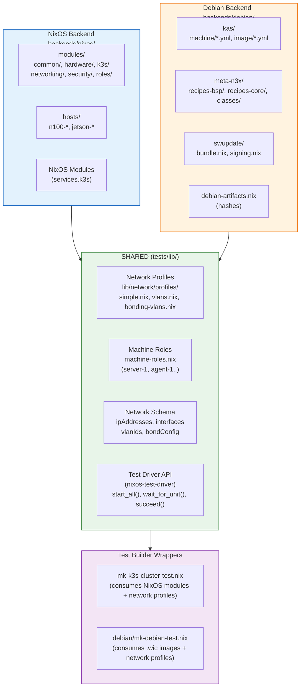

# tests/lib - Shared Test Infrastructure

This directory contains reusable test builders and network profiles for parameterized testing across multiple backends (NixOS, Debian).

## Backend Abstraction Overview

The following diagram illustrates how components are shared between NixOS and Debian backends, and what remains backend-specific:



### What's Shared vs Backend-Specific

| Component | Shared | NixOS-Specific | Debian-Specific |
|-----------|--------|----------------|-----------------|
| **Network profiles** | ✓ `lib/network/profiles/*.nix` | `nodeConfig` function | systemd-networkd file generation |
| **Machine naming** | ✓ `machine-roles.nix` | `nixosConfigurations.*` | kas machine configs |
| **IP addressing** | ✓ `ipAddresses` export | systemd-networkd | systemd-networkd |
| **Test scripts** | ✓ Python test logic | embedded in nixosTest | embedded in mkDebianTest |
| **Test driver** | ✓ nixos-test-driver | NixOS VMs | Debian .wic images |
| **K3s package** | | nixpkgs `k3s` | static binary recipe |
| **Build system** | | `nix build` | kas-container + BitBake (ISAR) |
| **OTA updates** | | systemd-sysupdate | SWUpdate |

### Data Flow: Network Profile to Running Test

```
┌──────────────────┐
│  Network Profile │
│  (vlans.nix)     │
└────────┬─────────┘
         │
         │ exports: ipAddresses, interfaces, vlanIds
         │          nodeConfig, k3sExtraFlags
         │
    ┌────┴────┐
    ▼         ▼
┌───────┐  ┌───────┐
│ NixOS │  │Debian │
└───┬───┘  └───┬───┘
    │          │
    │ uses     │ uses
    │nodeConfig│ ipAddresses
    │          │ + interfaces
    ▼          ▼
┌───────┐  ┌────────────┐
│systemd│  │  systemd   │
│networkd│ │ .network/  │
│(NixOS)│  │ .netdev    │
└───┬───┘  └─────┬──────┘
    │          │
    └────┬─────┘
         │
         ▼
┌──────────────────┐
│  nixos-test-     │
│  driver runs     │
│  Python test     │
│  script          │
└──────────────────┘
```

## Structure

```
tests/lib/
├── README.md                         # This file
├── mk-k3s-cluster-test.nix          # NixOS K3s cluster test builder
├── machine-roles.nix                 # Standard machine role definitions
├── NETWORK-SCHEMA.md                 # Network abstraction documentation
├── debian/                           # Debian backend test infrastructure
│   ├── mk-debian-test.nix           # Debian backend VM test builder
│   └── mk-debian-vm-script.nix      # Debian backend VM script generator
                                      # Network profiles live at lib/network/profiles/
                                      # (simple.nix, vlans.nix, bonding-vlans.nix, etc.)
└── test-scripts/                     # Shared Python test snippets (NEW)
    ├── default.nix                   # Main entry point with mkDefaultClusterTestScript
    ├── utils.nix                     # Core utilities (tlog, logging helpers)
    └── phases/                       # Test phases
        ├── boot.nix                  # VM boot and multi-user.target verification
        ├── network.nix               # Profile-aware network verification
        └── k3s.nix                   # K3s cluster formation and verification
```

## Purpose

Enables testing the same K3s cluster logic with different:
- **Network configurations**: Simple, VLANs, bonding + VLANs
- **Backends**: NixOS (native) or Debian (ISAR-based embedded)

This is the core of the cross-backend test sharing architecture.

## Exported via flake.nix

These are exported through `self.lib`:

```nix
# flake.nix lib exports
lib = {
  # NixOS K3s cluster test builder
  mkK3sClusterTest = import ./tests/lib/mk-k3s-cluster-test.nix;

  # Debian backend VM test builder
  mkDebianTest = { pkgs, lib ? pkgs.lib }:
    import ./tests/lib/debian/mk-debian-test.nix { inherit pkgs lib; };

  # Network profiles (for reference/extension)
  networkProfiles = {
    simple = import ./lib/network/profiles/simple.nix { inherit lib; };
    vlans = import ./lib/network/profiles/vlans.nix { inherit lib; };
    bonding-vlans = import ./lib/network/profiles/bonding-vlans.nix { inherit lib; };
    vlans-broken = import ./lib/network/profiles/vlans-broken.nix { inherit lib; };
  };
};
```

---

## mkK3sClusterTest (NixOS Tests)

Parameterized test builder for K3s clusters using NixOS VM test infrastructure.

### Usage

```nix
# In flake.nix checks
checks.x86_64-linux.my-test = pkgs.callPackage ./tests/lib/mk-k3s-cluster-test.nix {
  inherit pkgs lib;
  networkProfile = "vlans";  # or "simple" or "bonding-vlans"
  testName = "my-custom-test";  # optional
};
```

### Parameters

| Parameter | Type | Default | Description |
|-----------|------|---------|-------------|
| `networkProfile` | string | `"simple"` | Name of network profile to use |
| `testName` | string | `"k3s-cluster-${networkProfile}"` | Name of the test |
| `testScript` | string | Standard cluster test | Custom Python test script |
| `extraNodeConfig` | attrset | `{}` | Additional config merged into all nodes |

### Default Test Behavior

The default test script:
1. Boots all 3 nodes (n100-1, n100-2, n100-3)
2. Verifies network configuration per profile
3. Validates VLAN tags (for vlan profiles)
4. Tests storage network connectivity
5. Waits for K3s cluster formation
6. Verifies all nodes Ready
7. Checks CoreDNS and local-path-provisioner running

### Custom Test Script Example

```nix
pkgs.callPackage ./tests/lib/mk-k3s-cluster-test.nix {
  inherit pkgs lib;
  networkProfile = "vlans";
  testScript = ''
    start_all()
    n100_1.wait_for_unit("k3s.service")

    # Deploy a custom workload
    n100_1.succeed("kubectl apply -f /path/to/manifest.yaml")

    # Verify deployment
    n100_1.wait_until_succeeds("kubectl get pods -l app=myapp | grep Running")
  '';
}
```

---

## mkDebianTest (Debian Backend .wic Image Tests)

Creates NixOS-style VM tests for ISAR-built .wic images. Uses the nixos-test-driver with Debian backend images instead of NixOS VMs.

### Usage

```nix
# Import the builder
mkDebianTest = n3x.lib.mkDebianTest { inherit pkgs lib; };

# Create a test
myTest = mkDebianTest {
  name = "k3s-cluster";
  machines = {
    server = { image = ./path/to/server.wic; };
    agent1 = { image = ./path/to/agent.wic; };
    agent2 = { image = ./path/to/agent.wic; };
  };
  testScript = ''
    server.wait_for_unit("multi-user.target")
    agent1.wait_for_unit("multi-user.target")
    agent2.wait_for_unit("multi-user.target")

    # Wait for K3s cluster
    server.wait_until_succeeds("k3s kubectl get nodes | grep Ready | wc -l | grep 3")
  '';
};
```

### Parameters

| Parameter | Type | Default | Description |
|-----------|------|---------|-------------|
| `name` | string | required | Test name |
| `machines` | attrset | required | Map of machine name -> { image, memory?, cpus?, extraQemuArgs? } |
| `testScript` | string | required | Python test script (nixos-test-driver API) |
| `vlans` | list | `[1]` | VLAN numbers to create |
| `globalTimeout` | int | `3600` | Test timeout in seconds |
| `extraDriverArgs` | list | `[]` | Extra arguments for test driver |

### Machine Configuration

Each machine in `machines` accepts:

| Field | Type | Default | Description |
|-------|------|---------|-------------|
| `image` | path | required | Path to .wic image |
| `memory` | int | `4096` | Memory in MB |
| `cpus` | int | `4` | Number of CPUs |
| `extraQemuArgs` | list | `[]` | Additional QEMU arguments |

### Return Value

Returns an attribute set:

```nix
{
  test = <derivation>;      # Sandboxed test (for CI)
  driver = <derivation>;    # Interactive test driver
  vmScripts = { ... };      # Individual VM start scripts
}
```

### Running Tests

```bash
# Run sandboxed test (CI)
nix build '.#checks.x86_64-linux.my-debian-test'

# Run interactively
result/bin/run-test-interactive
```

---

## Network Profiles

Network profiles define how nodes communicate. Each profile provides the network configuration and K3s-specific flags.

### Available Profiles

| Profile | Description | Interfaces | Use Case |
|---------|-------------|------------|----------|
| `simple` | Flat network | eth1 | Development, baseline tests |
| `vlans` | 802.1Q VLANs | eth1.200 (cluster), eth1.100 (storage) | Production parity |
| `bonding-vlans` | Bonding + VLANs | bond0.200, bond0.100 | Full production |
| `vlans-broken` | Intentionally broken | N/A | Negative testing |

### Profile API

Each network profile provides both NixOS-specific configuration and abstract data for cross-backend consumption (e.g., Debian backend systemd-networkd file generation).

#### Core Exports (NixOS)

| Field | Type | Required | Description |
|-------|------|----------|-------------|
| `nodeIPs` or `clusterIPs` | attrset | Yes | Map of node names to IP addresses |
| `serverApi` | string | Yes | K3s API server URL |
| `clusterCidr` | string | Yes | K3s pod network CIDR |
| `serviceCidr` | string | Yes | K3s service network CIDR |
| `nodeConfig` | function | Yes | `nodeName -> NixOS module` |
| `k3sExtraFlags` | function | Yes | `nodeName -> [string]` |

#### Abstract Exports (P2.1 - Debian Backend systemd-networkd Generation)

These exports provide backend-agnostic network configuration data that the Debian backend can consume to generate systemd-networkd .network/.netdev files without understanding NixOS modules.

| Field | Type | Profiles | Description |
|-------|------|----------|-------------|
| `ipAddresses` | attrset | All | Per-node IP map: `{ n100-1 = { cluster = "..."; storage = "..."; }; }` |
| `interfaces` | attrset | All | Interface names: `{ cluster = "eth1.200"; trunk = "eth1"; }` |
| `vlanIds` | attrset | vlans, bonding-vlans | VLAN ID map: `{ cluster = 200; storage = 100; }` |
| `bondConfig` | attrset | bonding-vlans | Bond params: `{ mode = "active-backup"; miimon = 100; }` |

**Simple profile** uses `{ default = "eth1"; }` for interfaces and `{ default = "192.168.1.x"; }` for ipAddresses.

**VLAN profiles** use `{ cluster = "..."; storage = "..."; trunk = "..."; }` structure.

### Simple Profile

Single flat network - no VLANs, no bonding.

```
Topology: All nodes on 192.168.1.0/24 via eth1

n100-1: 192.168.1.1
n100-2: 192.168.1.2
n100-3: 192.168.1.3
```

### VLANs Profile

802.1Q VLAN tagging on single trunk interface.

```
Topology:
  eth1 (trunk) ─┬─ eth1.200 (cluster)  192.168.200.0/24
                └─ eth1.100 (storage)  192.168.100.0/24

Cluster IPs:                    Storage IPs:
  n100-1: 192.168.200.1           n100-1: 192.168.100.1
  n100-2: 192.168.200.2           n100-2: 192.168.100.2
  n100-3: 192.168.200.3           n100-3: 192.168.100.3
```

### Bonding + VLANs Profile

Active-backup bonding with VLAN tagging on bond interface.

```
Topology:
  eth1 ─┐
        ├─ bond0 (active-backup) ─┬─ bond0.200 (cluster)
  eth2 ─┘                         └─ bond0.100 (storage)

Same IP layout as VLANs profile.
```

### Adding a New Network Profile

1. Create `lib/network/profiles/myprofile.nix`:

```nix
{ lib }:

let
  nodeIPs = {
    n100-1 = "192.168.1.1";
    n100-2 = "192.168.1.2";
    n100-3 = "192.168.1.3";
  };
in
{
  inherit nodeIPs;

  serverApi = "https://${nodeIPs.n100-1}:6443";
  clusterCidr = "10.42.0.0/16";
  serviceCidr = "10.43.0.0/16";

  nodeConfig = nodeName: { config, pkgs, lib, ... }: {
    # Network configuration for this profile
    networking.interfaces.eth1.ipv4.addresses = [{
      address = nodeIPs.${nodeName};
      prefixLength = 24;
    }];
  };

  k3sExtraFlags = nodeName: [
    "--node-ip=${nodeIPs.${nodeName}}"
    "--flannel-iface=eth1"
  ];
}
```

2. Add to flake.nix `lib.networkProfiles`

3. Create test variant:

```nix
k3s-cluster-myprofile = pkgs.callPackage ./tests/lib/mk-k3s-cluster-test.nix {
  inherit pkgs lib;
  networkProfile = "myprofile";
};
```

---

## Shared Test Scripts (test-scripts/)

The `test-scripts/` directory contains reusable Python test snippets that can be shared between NixOS and Debian backends. This eliminates duplication of test logic.

### Architecture

```
test-scripts/
├── default.nix        # Entry point with mkDefaultClusterTestScript
├── utils.nix          # Core utilities (tlog, log_section, log_banner, log_summary)
└── phases/            # Test phases
    ├── boot.nix       # VM boot verification
    ├── network.nix    # Profile-aware network verification
    └── k3s.nix        # K3s cluster formation
```

### Usage (NixOS)

```nix
let
  testScripts = import ./test-scripts { inherit lib; };
in ''
  # Option 1: Use complete default cluster test script
  ${testScripts.mkDefaultClusterTestScript {
    profile = "vlans";
    nodes = { primary = "server_1"; secondary = "server_2"; agent = "agent_1"; };
    nodeNames = { primary = "server-1"; secondary = "server-2"; agent = "agent-1"; };
  }}

  # Option 2: Compose individual phases
  ${testScripts.utils.all}  # Import utilities (tlog, etc.)
  ${testScripts.phases.boot.bootAllNodes { nodes = ["server_1" "server_2"]; }}
  ${testScripts.phases.network.verifyInterfaces { profile = "vlans"; nodePairs = [...]; }}
  ${testScripts.phases.k3s.waitForPrimaryServer { node = "server_1"; }}
''
```

### Usage (Debian Backend)

Debian backend tests use the `*.debian.*` sub-modules which account for differences in service names and boot behavior:

```nix
let
  testScripts = import ../lib/test-scripts { inherit lib; };
  bootPhase = import ../lib/test-scripts/phases/boot.nix { inherit lib; };
  k3sPhase = import ../lib/test-scripts/phases/k3s.nix { inherit lib; };
in ''
  # Import utilities (required for tlog, log_banner, etc.)
  ${testScripts.utils.all}

  log_banner("Debian K3s Test", "server", {
      "Image": "qemuamd64 server",
      "Service": "k3s-server.service"
  })

  # Boot Debian VM via backdoor (Debian backend may not reach multi-user.target cleanly)
  ${bootPhase.debian.bootWithBackdoor { node = "server"; displayName = "Debian server"; }}

  # Verify k3s binary (at /usr/bin/k3s in Debian backend)
  ${k3sPhase.debian.verifyK3sBinary { node = "server"; }}

  # Wait for k3s-server.service (Debian backend uses k3s-server.service, not k3s.service)
  ${k3sPhase.debian.waitForK3sServer { node = "server"; timeout = 60; }}

  # Or use the complete test helper:
  # ${k3sPhase.debian.fullServerBootTest { node = "server"; }}

  log_summary("Debian K3s Test", "server", ["k3s binary present", "Service started"])
''
```

**Key Debian backend differences:**
- Boot: Use `bootPhase.debian.bootWithBackdoor` instead of `wait_for_unit("multi-user.target")`
- K3s service: `k3s-server.service` / `k3s-agent.service` (not `k3s.service`)
- K3s binary: `/usr/bin/k3s` (not `/run/current-system/sw/bin/k3s`)

### Available Utilities (utils.nix)

| Function | Description |
|----------|-------------|
| `tlog(msg)` | Print timestamped log message |
| `log_section(phase, desc)` | Print formatted section header |
| `log_banner(title, profile, info)` | Print test banner with info dict |
| `log_summary(title, profile, validations)` | Print test success summary |

### Available Phases

**boot.nix** (NixOS):
- `bootAllNodes { nodes }` - Boot all nodes, wait for multi-user.target
- `bootSingleNode { node, displayName }` - Boot single node
- `startAll` - Just start_all() with logging

**boot.nix** (Debian backend - via `boot.debian.*`):
- `bootWithBackdoor { node, displayName }` - Boot single Debian backend VM via backdoor service
- `bootAllWithBackdoor { nodes }` - Boot multiple Debian backend VMs via backdoor
- `checkSystemStatus { node }` - Diagnostic helper for systemd status

**network.nix**:
- `verifyInterfaces { profile, nodePairs }` - Verify interfaces for profile
- `verifyVlanTags { profile, nodePairs }` - Verify VLAN tags (vlans/bonding-vlans only)
- `verifyStorageNetwork { profile, nodePairs }` - Verify storage network connectivity
- `verifyCrossVlanIsolation { profile, nodePairs }` - Best-effort VLAN isolation check
- `verifyAll { profile, nodePairs }` - Run all network checks for profile

**k3s.nix** (NixOS):
- `waitForPrimaryServer { node, displayName }` - Wait for primary server k3s
- `waitForPrimaryReady { node, nodeName }` - Wait for primary node Ready
- `waitForSecondaryServer { primary, secondary, secondaryNodeName }` - Wait for secondary
- `waitForAgent { primary, agent, agentNodeName }` - Wait for agent
- `waitForAllNodesReady { primary, expectedCount }` - Verify all nodes Ready
- `verifySystemComponents { primary }` - Verify CoreDNS, local-path-provisioner
- `verifyCluster { primary, secondary, agent, ... }` - Complete cluster verification
- `waitForK3sService { node }` - Single-node K3s service check (for smoke tests)

**k3s.nix** (Debian backend - via `k3s.debian.*`):
- `verifyK3sBinary { node }` - Check k3s binary at /usr/bin/k3s
- `waitForK3sServer { node, timeout? }` - Wait for k3s-server.service
- `waitForK3sAgent { node, timeout? }` - Wait for k3s-agent.service
- `waitForKubeconfig { node, maxAttempts?, sleepSecs? }` - Wait for kubeconfig file
- `verifyKubectl { node }` - Verify kubectl works, show nodes/pods
- `fullServerBootTest { node, displayName? }` - Complete Debian backend K3s server boot test

### nodePairs Format

The network verification functions expect `nodePairs` with this structure:

```nix
nodePairs = [
  { node = "server_1"; name = "server-1"; clusterIpSuffix = 1; storageIpSuffix = 1; }
  { node = "server_2"; name = "server-2"; clusterIpSuffix = 2; storageIpSuffix = 2; }
  { node = "agent_1"; name = "agent-1"; clusterIpSuffix = 3; storageIpSuffix = 3; }
];
```

- `node`: Python variable name in test script
- `name`: Human-readable name for logging
- `clusterIpSuffix`/`storageIpSuffix`: Last octet of IP address

---

## Cross-Backend Test Sharing

The shared test infrastructure enables running the same test logic across NixOS and Debian backends.

### Architecture

```
tests/lib/
├── mk-k3s-cluster-test.nix    ←── NixOS backend uses directly
├── debian/mk-debian-test.nix  ←── Debian backend wraps with .wic images
                                    (Network profiles at lib/network/profiles/)
```

### Same Test Script, Different Backends

Test scripts use the standard nixos-test-driver API:

```python
# This script works on both NixOS and Debian backend
start_all()
server.wait_for_unit("multi-user.target")
server.wait_for_unit("k3s.service")
server.wait_until_succeeds("k3s kubectl get nodes | grep Ready")
```

The underlying VM infrastructure differs:
- **NixOS**: Native NixOS VMs built by nixos-test-driver
- **Debian**: .wic images from ISAR BitBake/kas build system

### Sharing Network Profiles with the Debian Backend

The Debian backend imports the abstract profile exports for systemd-networkd configuration generation via `lib/network/mk-systemd-networkd.nix`.

```nix
# In lib/network/ - generates .network/.netdev files from profile data
let
  profile = n3x.lib.networkProfiles.vlans;
  mkSystemdNetworkdFiles = import ./mk-systemd-networkd.nix { inherit lib; };

  # Generate systemd-networkd config files for a specific node
  networkdFiles = mkSystemdNetworkdFiles {
    inherit (profile) ipAddresses interfaces vlanIds;
    nodeName = "server-1";
  };
  # Returns: { "10-trunk.network" = "..."; "20-cluster.network" = "..."; ... }
in
{
  # For bonding-vlans profile, also uses profile.bondConfig for bond parameters
  # For simple profile, just uses profile.ipAddresses.${nodeName}.default
}
```

This abstraction enables the Debian backend to generate systemd-networkd configuration that matches NixOS test profiles without importing NixOS modules.

---

## Examples

### Run Simple Profile Test
```bash
nix build '.#checks.x86_64-linux.k3s-cluster-simple' --rebuild
```

### Run VLAN Profile Test
```bash
nix build '.#checks.x86_64-linux.k3s-cluster-vlans' --rebuild
```

### Run Bonding + VLANs Test
```bash
nix build '.#checks.x86_64-linux.k3s-cluster-bonding-vlans' --rebuild
```

### Interactive Testing
```bash
# Build and enter interactive mode
nix build '.#checks.x86_64-linux.k3s-cluster-simple'
result/bin/nixos-test-driver --interactive
```

---

## Testing Guide

See [docs/VLAN-TESTING-GUIDE.md](../../docs/VLAN-TESTING-GUIDE.md) for comprehensive testing instructions.

## Maintenance

**When modifying test logic:**
1. Edit `mk-k3s-cluster-test.nix` or `debian/mk-debian-test.nix`
2. Changes automatically apply to all test variants
3. Test all profiles to ensure compatibility

**When adding network profiles:**
1. Create profile in `lib/network/profiles/`
2. Add to `flake.nix` lib.networkProfiles
3. Add test variant to `flake.nix` checks
4. Update this README

**When adding Debian backend tests:**
1. Build .wic images via kas-container
2. Import mkDebianTest from flake lib
3. Define test with machines and testScript
4. Add to flake checks
