# Embedded System Emulator

## Portable Full-Stack Compute and Network Simulation Platform

A declarative NixOS-based solution for emulating embedded systems with heterogeneous compute nodes, controlled resources, and realistic network topology—portable from laptop to cloud without modification.

---

## Executive Summary

This platform demonstrates how to fully emulate an embedded system architecture using nested virtualization, enabling:

- **CPU and RAM control** per node via QEMU/KVM resource limits
- **Network throughput control** via traffic control (tc) and OVS QoS
- **Cross-architecture support** (x86_64 and ARM64 emulation)
- **Kubernetes orchestration** via k3s lightweight distribution
- **Hardware switch simulation** via Open vSwitch (or optional Marvell CPSS)
- **Complete portability** — runs identically on laptops, workstations, or cloud servers

**Primary Use Case**: Test automation for embedded systems that require realistic hardware simulation without cloud dependencies.

---

## System Architecture

### Physical Topology Being Emulated

```
┌─────────────────────────────────────────────────────────────────────────┐
│                         PHYSICAL CHASSIS BOARD                          │
│  ┌─────────────────────────────────────────────────────────────────┐   │
│  │                   Jetson/Nano SOM (ARM64)                        │   │
│  │                   Running: Linux + k3s Server                    │   │
│  │                   Role: Chassis Controller                       │   │
│  └──────────────────────────┬──────────────────────────────────────┘   │
│                             │                                           │
│  ┌──────────────────────────┴──────────────────────────────────────┐   │
│  │                    MARVELL SWITCH FABRIC                         │   │
│  │                    (Embedded on Chassis Board)                   │   │
│  │    ┌─────────┐        ┌─────────┐        ┌─────────┐            │   │
│  │    │ Port 1  │        │ Port 2  │        │ Port 3  │            │   │
│  └────┴────┬────┴────────┴────┬────┴────────┴────┬────┴────────────┘   │
│            │                  │                  │                      │
└────────────┼──────────────────┼──────────────────┼──────────────────────┘
             │                  │                  │
     ┌───────┴───────┐  ┌───────┴───────┐  ┌───────┴───────┐
     │ COMPUTE NODE  │  │ STORAGE NODE  │  │ EXTERNAL      │
     │ (x86_64)      │  │ (x86_64)      │  │ CONNECTIONS   │
     │ k3s Agent     │  │ k3s Agent     │  │               │
     │               │  │ + Storage     │  │               │
     └───────────────┘  └───────────────┘  └───────────────┘
```

### Emulated Architecture

```mermaid
flowchart TB
    subgraph host["🖥️ Physical Host (Laptop / Server / Cloud VM)"]
        direction TB
        subgraph outer["Outer VM • NixOS Hypervisor Layer"]
            direction TB
            
            subgraph services["System Services"]
                libvirt["libvirtd"]
                ovs_daemon["openvswitch"]
                systemd_net["systemd-networkd"]
                tc["tc (traffic control)"]
            end
            
            subgraph switch["Marvell Switch Emulation<br/>Open vSwitch: ovsbr0"]
                direction TB
                
                subgraph mgmt_port["Management Port"]
                    vnet0["vnet0<br/>192.168.100.1/24"]
                end
                
                switch_fabric["🔀 OVS Switch Fabric<br/>VLAN / QoS / tc shaping"]
                
                subgraph chassis_port["Port 1: Chassis"]
                    chassis_tap["vnet-chassis"]
                end
                
                subgraph compute_port["Port 2: Compute"]
                    compute_tap["vnet-compute"]
                end
                
                subgraph storage_port["Port 3: Storage"]
                    storage_tap["vnet-storage"]
                end
            end
            
            subgraph vms["Inner VMs (k3s Cluster)"]
                direction TB
                
                subgraph chassis_vm["🖥️ CHASSIS (ARM64)"]
                    chassis_info["Jetson/Nano SOM Emulation<br/>NixOS Minimal + k3s Server<br/>MAC: 52:54:00:12:34:01<br/>1GB RAM • 2 vCPU (emulated)"]
                end
                
                subgraph compute_vm["🖥️ COMPUTE (x86_64)"]
                    compute_info["Compute Node<br/>NixOS Minimal + k3s Agent<br/>MAC: 52:54:00:12:34:02<br/>512MB RAM • 1 vCPU"]
                end
                
                subgraph storage_vm["🖥️ STORAGE (x86_64)"]
                    storage_info["Storage Node<br/>NixOS Minimal + k3s Agent<br/>MAC: 52:54:00:12:34:03<br/>512MB RAM • 1 vCPU<br/>+ 10GB storage disk"]
                end
            end
            
            vnet0 <--> switch_fabric
            switch_fabric <--> chassis_tap
            switch_fabric <--> compute_tap
            switch_fabric <--> storage_tap
            
            chassis_tap <--> chassis_vm
            compute_tap <--> compute_vm
            storage_tap <--> storage_vm
            
            libvirt --> chassis_vm
            libvirt --> compute_vm
            libvirt --> storage_vm
            ovs_daemon --> switch_fabric
            tc --> switch_fabric
            systemd_net --> vnet0
        end
    end
    
    style host fill:#f5f5f5,stroke:#333
    style outer fill:#e1f5ff,stroke:#1976d2
    style switch fill:#fff4e1,stroke:#f57c00
    style services fill:#e8f5e9,stroke:#388e3c
    style vms fill:#fce4ec,stroke:#c2185b
    style chassis_vm fill:#e3f2fd,stroke:#1565c0
    style compute_vm fill:#fff3e0,stroke:#ef6c00
    style storage_vm fill:#f3e5f5,stroke:#7b1fa2
    style switch_fabric fill:#90EE90,stroke:#2e7d32
```



---

## Node Specifications

| Node | Architecture | Role | Resources | Network | Special Features |
|------|--------------|------|-----------|---------|------------------|
| **Chassis** | ARM64 (aarch64) | k3s Server, Cluster Control | 1GB RAM, 2 vCPU | 192.168.100.10 | QEMU TCG emulation, Marvell switch access |
| **Compute** | x86_64 | k3s Agent, Workloads | 512MB RAM, 1 vCPU | 192.168.100.11 | KVM acceleration |
| **Storage** | x86_64 | k3s Agent, Persistent Storage | 512MB RAM, 1 vCPU | 192.168.100.12 | Additional 10GB virtio disk |

### k3s Cluster Topology


---

## Resource Control Capabilities

### CPU and Memory Control

Resources are controlled at two levels:

**1. VM-Level (libvirt/QEMU)**
```xml
<!-- Per-VM resource limits in libvirt domain XML -->
<memory unit='MiB'>512</memory>
<vcpu placement='static'>1</vcpu>
<cputune>
  <shares>1024</shares>           <!-- CPU weight (relative priority) -->
  <period>100000</period>         <!-- CFS period in microseconds -->
  <quota>50000</quota>            <!-- CPU quota (50% of one core) -->
</cputune>
<memtune>
  <hard_limit unit='MiB'>600</hard_limit>   <!-- Absolute memory ceiling -->
  <soft_limit unit='MiB'>512</soft_limit>   <!-- Preferred limit -->
</memtune>
```

**2. Kubernetes-Level (k3s)**
```yaml
# Resource constraints for pods
resources:
  limits:
    cpu: "500m"
    memory: "256Mi"
  requests:
    cpu: "100m"
    memory: "128Mi"
```

### Network Throughput Control

**1. libvirt QoS (Per-Interface)**
```xml
<interface type='bridge'>
  <source bridge='ovsbr0'/>
  <bandwidth>
    <inbound average='1000' peak='5000' burst='1024'/>   <!-- kbps -->
    <outbound average='1000' peak='5000' burst='1024'/>
  </bandwidth>
</interface>
```

**2. Linux Traffic Control (tc)**
```bash
# Limit chassis port to 100Mbps with 50ms latency (simulating embedded constraints)
tc qdisc add dev vnet-chassis root tbf rate 100mbit latency 50ms burst 1540

# Simulate packet loss for testing resilience
tc qdisc add dev vnet-compute root netem loss 0.1%

# Add delay to simulate geographic distribution
tc qdisc add dev vnet-storage root netem delay 10ms 5ms distribution normal
```

**3. Open vSwitch QoS**
```bash
# Create QoS policy
ovs-vsctl set port vnet-chassis qos=@newqos -- \
  --id=@newqos create qos type=linux-htb other-config:max-rate=100000000 \
  queues=0=@q0 -- \
  --id=@q0 create queue other-config:min-rate=10000000 other-config:max-rate=100000000
```

---

## Technology Stack

| Component | Purpose | Documentation |
|-----------|---------|---------------|
| **NixOS** | Declarative Linux distribution | [nixos.org/manual](https://nixos.org/manual/nixos/stable/) |
| **KVM/QEMU** | Hardware virtualization / emulation | [linux-kvm.org](https://www.linux-kvm.org/) |
| **libvirt** | Virtualization management API | [libvirt.org](https://libvirt.org/docs.html) |
| **Open vSwitch** | Software-defined switch | [openvswitch.org](https://docs.openvswitch.org/) |
| **k3s** | Lightweight Kubernetes | [k3s.io](https://k3s.io/) |
| **tc (iproute2)** | Traffic control / shaping | [man7.org/tc](https://man7.org/linux/man-pages/man8/tc.8.html) |
| **QEMU aarch64** | ARM64 full-system emulation | [qemu.org](https://www.qemu.org/docs/master/system/target-arm.html) |

---

## NixOS Configuration

```nix
# embedded-system-emulator.nix
#
# Declarative configuration for embedded system emulation platform
#
# USAGE:
#   1. Build:  nixos-rebuild build-vm -I nixos-config=./embedded-system-emulator.nix
#   2. Run:    ./result/bin/run-*-vm
#   3. Inside: virsh list --all && virsh start chassis

{ config, pkgs, lib, ... }:

let
  #############################################################################
  # CONFIGURATION
  #############################################################################

  network = {
    bridge = "ovsbr0";
    hostInterface = "vnet0";
    hostIP = "192.168.100.1";
    cidr = "/24";
    dhcpStart = "192.168.100.100";
    dhcpEnd = "192.168.100.200";
  };

  # k3s cluster token (generate with: openssl rand -hex 32)
  k3sToken = "REPLACE_WITH_SECURE_TOKEN";

  #############################################################################
  # VM DEFINITIONS - Embedded System Nodes
  #############################################################################

  vmDefinitions = [
    # CHASSIS: ARM64 Jetson/Nano SOM emulation - k3s Server (Control Plane)
    {
      name = "chassis";
      mac = "52:54:00:12:34:01";
      arch = "aarch64";          # ARM64 emulation via QEMU TCG
      memory = 1024;             # 1GB RAM
      vcpus = 2;
      ip = "192.168.100.10";
      role = "k3s-server";
      description = "Jetson/Nano SOM - k3s Control Plane";
      # ARM64 is slower due to emulation, allocate more resources
      cpuModel = "cortex-a57";
    }
    # COMPUTE: x86_64 compute node - k3s Agent
    {
      name = "compute";
      mac = "52:54:00:12:34:02";
      arch = "x86_64";           # Native KVM acceleration
      memory = 512;              # 512MB RAM
      vcpus = 1;
      ip = "192.168.100.11";
      role = "k3s-agent";
      description = "Compute Node - k3s Worker";
      cpuModel = "host-passthrough";
    }
    # STORAGE: x86_64 storage node - k3s Agent with extra disk
    {
      name = "storage";
      mac = "52:54:00:12:34:03";
      arch = "x86_64";           # Native KVM acceleration
      memory = 512;              # 512MB RAM
      vcpus = 1;
      ip = "192.168.100.12";
      role = "k3s-agent";
      description = "Storage Node - k3s Worker + Persistent Storage";
      cpuModel = "host-passthrough";
      extraDiskSize = 10;        # 10GB additional storage disk
    }
  ];

  #############################################################################
  # NETWORK QOS PROFILES - Simulating Hardware Constraints
  #############################################################################

  qosProfiles = {
    chassis = {
      # Embedded ARM typically has limited network I/O
      inbound = { average = 100000; peak = 200000; burst = 10240; };  # 100Mbps
      outbound = { average = 100000; peak = 200000; burst = 10240; };
    };
    compute = {
      inbound = { average = 1000000; peak = 2000000; burst = 10240; }; # 1Gbps
      outbound = { average = 1000000; peak = 2000000; burst = 10240; };
    };
    storage = {
      inbound = { average = 1000000; peak = 2000000; burst = 10240; };  # 1Gbps
      outbound = { average = 1000000; peak = 2000000; burst = 10240; };
    };
  };

  #############################################################################
  # VM TEMPLATE GENERATOR
  #############################################################################

  mkLibvirtXML = vm:
    let
      isArm = vm.arch == "aarch64";
      emulator = if isArm 
        then "${pkgs.qemu}/bin/qemu-system-aarch64"
        else "${pkgs.qemu}/bin/qemu-system-x86_64";
      machineType = if isArm then "virt" else "q35";
      cpuMode = if isArm then "cortex-a57" else "host-passthrough";
      qos = qosProfiles.${vm.name} or qosProfiles.compute;
      extraDisk = if (vm ? extraDiskSize && vm.extraDiskSize > 0) then ''
        <disk type='file' device='disk'>
          <driver name='qemu' type='qcow2' cache='writeback'/>
          <source file='/var/lib/libvirt/images/${vm.name}-data.qcow2'/>
          <target dev='vdb' bus='virtio'/>
        </disk>
      '' else "";
      # ARM64 requires UEFI firmware
      firmwareConfig = if isArm then ''
        <loader readonly='yes' type='pflash'>${pkgs.OVMF.fd}/AAVMF/QEMU_EFI-pflash.raw</loader>
        <nvram template='${pkgs.OVMF.fd}/AAVMF/vars-template-pflash.raw'>/var/lib/libvirt/qemu/nvram/${vm.name}_VARS.fd</nvram>
      '' else "";
    in
    pkgs.writeText "${vm.name}.xml" ''
      <domain type='${if isArm then "qemu" else "kvm"}'>
        <name>${vm.name}</name>
        <description>${vm.description}</description>
        <memory unit='MiB'>${toString vm.memory}</memory>
        <vcpu placement='static'>${toString vm.vcpus}</vcpu>
        
        <!-- Resource Controls -->
        <cputune>
          <shares>${toString (vm.vcpus * 1024)}</shares>
        </cputune>
        <memtune>
          <hard_limit unit='MiB'>${toString (vm.memory + 128)}</hard_limit>
        </memtune>
        
        <cpu mode='${if isArm then "custom" else "host-passthrough"}'>
          ${if isArm then "<model>${vm.cpuModel}</model>" else ""}
        </cpu>
        
        <os>
          <type arch='${vm.arch}' machine='${machineType}'>hvm</type>
          ${firmwareConfig}
          <boot dev='hd'/>
        </os>
        
        <features>
          <acpi/>
          ${if !isArm then "<apic/>" else ""}
          ${if isArm then "<gic version='3'/>" else ""}
        </features>
        
        <devices>
          <emulator>${emulator}</emulator>
          
          <!-- System Disk -->
          <disk type='file' device='disk'>
            <driver name='qemu' type='qcow2' cache='writeback'/>
            <source file='/var/lib/libvirt/images/${vm.name}.qcow2'/>
            <target dev='vda' bus='virtio'/>
          </disk>
          
          ${extraDisk}
          
          <!-- Network Interface with QoS -->
          <interface type='bridge'>
            <source bridge='${network.bridge}'/>
            <virtualport type='openvswitch'/>
            <mac address='${vm.mac}'/>
            <model type='virtio'/>
            <bandwidth>
              <inbound average='${toString qos.inbound.average}' 
                       peak='${toString qos.inbound.peak}' 
                       burst='${toString qos.inbound.burst}'/>
              <outbound average='${toString qos.outbound.average}' 
                        peak='${toString qos.outbound.peak}' 
                        burst='${toString qos.outbound.burst}'/>
            </bandwidth>
            <alias name='vnet-${vm.name}'/>
          </interface>
          
          <serial type='pty'><target port='0'/></serial>
          <console type='pty'><target type='serial' port='0'/></console>
          <graphics type='vnc' port='-1' autoport='yes' listen='127.0.0.1'/>
        </devices>
      </domain>
    '';

  innerVMs = map (vm: vm // { xml = mkLibvirtXML vm; }) vmDefinitions;

in {

  #############################################################################
  # KERNEL & VIRTUALIZATION
  #############################################################################

  boot.kernelModules = [ "kvm-intel" "kvm-amd" "vhost_net" ];

  # Enable binfmt for ARM64 emulation
  boot.binfmt.emulatedSystems = [ "aarch64-linux" ];

  virtualisation = {
    memorySize = 8192;    # 8GB for outer VM (hosts 3 inner VMs)
    cores = 8;
    diskSize = 50000;     # 50GB disk
  };

  #############################################################################
  # LIBVIRT CONFIGURATION
  #############################################################################

  virtualisation.libvirtd = {
    enable = true;
    qemu = {
      ovmf.enable = true;
      ovmf.packages = [ pkgs.OVMF.fd ];
      runAsRoot = true;
      # Enable ARM64 emulation
      package = pkgs.qemu;
    };
  };

  #############################################################################
  # OPEN VSWITCH - MARVELL SWITCH EMULATION
  #############################################################################

  services.openvswitch.enable = true;

  networking.vswitches.${network.bridge} = {
    interfaces = {};
    extraOvsctlCmds = ''
      -- --may-exist add-port ${network.bridge} ${network.hostInterface} \
      -- set interface ${network.hostInterface} type=internal
    '';
  };

  systemd.network = {
    enable = true;
    networks."50-ovs-internal" = {
      matchConfig.Name = network.hostInterface;
      address = [ "${network.hostIP}${network.cidr}" ];
      networkConfig.ConfigureWithoutCarrier = true;
    };
  };

  #############################################################################
  # DNSMASQ - DHCP/DNS FOR INNER VMS
  #############################################################################

  services.dnsmasq = {
    enable = true;
    settings = {
      interface = network.hostInterface;
      bind-interfaces = true;
      dhcp-range = [ "${network.dhcpStart},${network.dhcpEnd},12h" ];
      # Static IP assignments for predictable addressing
      dhcp-host = map (vm: "${vm.mac},${vm.name},${vm.ip}") vmDefinitions;
      # DNS for cluster nodes
      address = map (vm: "/${vm.name}.local/${vm.ip}") vmDefinitions;
    };
  };

  #############################################################################
  # INNER VM SETUP SERVICE
  #############################################################################

  systemd.services.setup-inner-vms = {
    description = "Initialize embedded system node VMs";
    after = [ "libvirtd.service" "openvswitch.service" ];
    wants = [ "libvirtd.service" "openvswitch.service" ];
    wantedBy = [ "multi-user.target" ];
    serviceConfig = { Type = "oneshot"; RemainAfterExit = true; };
    path = [ pkgs.qemu pkgs.libvirt ];

    script = ''
      set -euo pipefail
      mkdir -p /var/lib/libvirt/images
      mkdir -p /var/lib/libvirt/qemu/nvram

      ${lib.concatMapStrings (vm: ''
        # Create system disk if not exists
        [ -f /var/lib/libvirt/images/${vm.name}.qcow2 ] || \
          qemu-img create -f qcow2 /var/lib/libvirt/images/${vm.name}.qcow2 4G
        
        ${lib.optionalString (vm ? extraDiskSize && vm.extraDiskSize > 0) ''
          # Create extra storage disk
          [ -f /var/lib/libvirt/images/${vm.name}-data.qcow2 ] || \
            qemu-img create -f qcow2 /var/lib/libvirt/images/${vm.name}-data.qcow2 ${toString vm.extraDiskSize}G
        ''}
        
        # Define VM
        virsh dominfo ${vm.name} &>/dev/null || virsh define ${vm.xml}
        
        echo "✓ Configured: ${vm.name} (${vm.arch}) - ${vm.description}"
      '') innerVMs}
    '';
  };

  #############################################################################
  # TRAFFIC CONTROL SETUP - NETWORK SIMULATION
  #############################################################################

  systemd.services.setup-network-simulation = {
    description = "Configure network simulation parameters";
    after = [ "openvswitch.service" "setup-inner-vms.service" ];
    wants = [ "openvswitch.service" ];
    wantedBy = [ "multi-user.target" ];
    serviceConfig = { Type = "oneshot"; RemainAfterExit = true; };
    path = [ pkgs.iproute2 pkgs.openvswitch ];

    script = ''
      # Wait for OVS bridge to be ready
      sleep 2
      
      # Configure OVS bridge for better switch simulation
      ovs-vsctl set bridge ${network.bridge} \
        stp_enable=true \
        other_config:forward-bpdu=true \
        fail_mode=standalone
      
      echo "✓ OVS switch fabric configured"
      
      # Note: tc rules are applied per-interface after VMs start
      # See the tc-simulate-constraints script for runtime adjustments
    '';
  };

  #############################################################################
  # PACKAGES & TOOLS
  #############################################################################

  environment.systemPackages = with pkgs; [
    # Virtualization
    libvirt virt-manager qemu
    
    # Networking
    openvswitch bridge-utils iproute2 tcpdump iperf3
    
    # Kubernetes
    k3s kubectl kubernetes-helm
    
    # Debugging
    htop tmux vim curl wget
  ];

  #############################################################################
  # CONVENIENCE SCRIPTS
  #############################################################################

  environment.etc."tc-simulate-constraints.sh" = {
    mode = "0755";
    text = ''
      #!/usr/bin/env bash
      # Simulate embedded system network constraints
      # Usage: tc-simulate-constraints.sh [profile]
      # Profiles: default, constrained, lossy
      
      PROFILE=''${1:-default}
      
      case $PROFILE in
        constrained)
          # Simulate resource-constrained embedded network
          tc qdisc replace dev vnet-chassis root tbf rate 10mbit latency 100ms burst 1540
          tc qdisc replace dev vnet-compute root tbf rate 100mbit latency 10ms burst 1540
          tc qdisc replace dev vnet-storage root tbf rate 100mbit latency 10ms burst 1540
          echo "Applied constrained network profile"
          ;;
        lossy)
          # Simulate unreliable network for resilience testing
          tc qdisc replace dev vnet-chassis root netem loss 1% delay 50ms 10ms
          tc qdisc replace dev vnet-compute root netem loss 0.5% delay 20ms 5ms
          tc qdisc replace dev vnet-storage root netem loss 0.5% delay 20ms 5ms
          echo "Applied lossy network profile"
          ;;
        default|*)
          # Remove all constraints
          tc qdisc del dev vnet-chassis root 2>/dev/null || true
          tc qdisc del dev vnet-compute root 2>/dev/null || true
          tc qdisc del dev vnet-storage root 2>/dev/null || true
          echo "Removed network constraints (default profile)"
          ;;
      esac
    '';
  };

  #############################################################################
  # USER CONFIGURATION
  #############################################################################

  services.getty.autologinUser = "root";
  users.users.root.initialPassword = "demo";
  users.users.root.extraGroups = [ "libvirtd" ];

  environment.etc."motd".text = ''

    ╔════════════════════════════════════════════════════════════════════════╗
    ║           🖥️  Embedded System Emulator Ready  🖥️                       ║
    ╠════════════════════════════════════════════════════════════════════════╣
    ║                                                                        ║
    ║  CLUSTER NODES:                                                        ║
    ║    • chassis  (ARM64) - k3s Server  - 192.168.100.10                   ║
    ║    • compute  (x86)   - k3s Agent   - 192.168.100.11                   ║
    ║    • storage  (x86)   - k3s Agent   - 192.168.100.12                   ║
    ║                                                                        ║
    ║  COMMANDS:                                                             ║
    ║    virsh list --all              # List all VMs                        ║
    ║    virsh start chassis           # Start chassis node                  ║
    ║    virsh console chassis         # Console (Ctrl+] to exit)            ║
    ║    ovs-vsctl show                # View switch topology                ║
    ║    /etc/tc-simulate-constraints.sh constrained  # Apply limits         ║
    ║                                                                        ║
    ║  NETWORK: ${network.bridge} @ ${network.hostIP}${network.cidr}                          ║
    ║                                                                        ║
    ╚════════════════════════════════════════════════════════════════════════╝

  '';

  system.stateVersion = "24.05";
}
```

---

## Validation & Testing

### Prerequisites

Enable nested virtualization on your physical host:

```bash
# Check current status
cat /sys/module/kvm_intel/parameters/nested  # Intel: Y or 1
cat /sys/module/kvm_amd/parameters/nested    # AMD: 1

# Enable if needed (Intel example)
echo "options kvm_intel nested=1" | sudo tee /etc/modprobe.d/kvm-nested.conf
sudo modprobe -r kvm_intel && sudo modprobe kvm_intel
```

### Build & Launch

```bash
nixos-rebuild build-vm -I nixos-config=./embedded-system-emulator.nix
./result/bin/run-*-vm
```

### Verify Services

```bash
# Check all services are running
systemctl is-active libvirtd openvswitch setup-inner-vms dnsmasq
# Expected: active active active active

# Verify OVS bridge
ovs-vsctl show
# Expected: Bridge ovsbr0 with internal port

# Verify VMs are defined
virsh list --all
# Expected:
#  Id   Name      State
# -------------------------
#  -    chassis   shut off
#  -    compute   shut off
#  -    storage   shut off
```

### Start Cluster and Test

```bash
# Start all VMs
for vm in chassis compute storage; do virsh start $vm; done

# Wait for VMs to boot, then verify network
ping -c 3 192.168.100.10  # chassis
ping -c 3 192.168.100.11  # compute
ping -c 3 192.168.100.12  # storage

# After k3s is configured, verify cluster
# (from chassis VM or with kubectl configured)
kubectl get nodes -o wide
```

### Test Network Constraints

```bash
# Apply constrained network profile
/etc/tc-simulate-constraints.sh constrained

# Run bandwidth test
iperf3 -c 192.168.100.10 -t 10

# Apply lossy profile for resilience testing
/etc/tc-simulate-constraints.sh lossy

# Verify packet loss
ping -c 100 192.168.100.10 | tail -2

# Reset to default
/etc/tc-simulate-constraints.sh default
```

---

## Troubleshooting

| Issue | Solution |
|-------|----------|
| ARM64 VM very slow | Expected behavior - TCG emulation is ~10-20x slower than native. Consider x86_64-only mode for faster testing. |
| `virsh list` empty | `systemctl restart setup-inner-vms` |
| No IP on VMs | Check `systemctl status dnsmasq` and `journalctl -u dnsmasq` |
| VM won't start | Check `/dev/kvm` exists; verify nested virt is enabled on host |
| OVS bridge missing ports | `ovs-vsctl show` - ports are created dynamically when VMs start |
| k3s agents can't join | Verify network connectivity and k3s token matches |

---

## Next Steps

### Installing NixOS on Inner VMs

The inner VMs have empty disks. Boot from NixOS ISO and install minimal systems:

```bash
# Download NixOS ISO (from host or accessible URL)
# For x86_64:
curl -LO https://channels.nixos.org/nixos-24.05/latest-nixos-minimal-x86_64-linux.iso

# For ARM64 (chassis):
curl -LO https://hydra.nixos.org/build/[BUILD_ID]/download/1/nixos-sd-image-24.05-aarch64-linux.img

# Attach ISO to VM
virsh attach-disk compute /path/to/nixos.iso hdc --type cdrom --mode readonly
virsh start compute
virsh console compute
```

### k3s Cluster Setup

Once NixOS is installed on each node, configure k3s:

**On Chassis (Server):**
```nix
# Add to configuration.nix
services.k3s = {
  enable = true;
  role = "server";
  extraFlags = toString [
    "--disable traefik"
    "--disable servicelb"
  ];
};
networking.firewall.allowedTCPPorts = [ 6443 ];
```

**On Compute/Storage (Agents):**
```nix
services.k3s = {
  enable = true;
  role = "agent";
  serverAddr = "https://192.168.100.10:6443";
  tokenFile = /var/lib/k3s/token;  # Copy from server
};
```

---

## Appendix A: Marvell Switch Simulation Options

### Research Summary

Based on comprehensive research, there are two viable approaches to simulating the Marvell switch fabric:

#### Option 1: Open vSwitch (Recommended for Initial Development)

**Advantages:**
- Mature, well-documented software switch
- Native NixOS support
- Full OpenFlow protocol support
- Excellent QoS and traffic control capabilities
- VLAN, STP, LACP support
- Easy integration with Linux tc for traffic shaping
- No proprietary software required

**Limitations:**
- Does not simulate Marvell-specific register interface
- No DSA (Distributed Switch Architecture) tag simulation
- Cannot test Marvell-specific features

**When to Use:**
- Initial development and CI/CD testing
- Network topology and k3s cluster validation
- Performance testing with traffic shaping
- Most test automation scenarios

#### Option 2: Marvell CPSS (Advanced/Future Option)

**What is CPSS?**
CPSS (Core Prestera Software Suite) is Marvell's SDK for their Prestera switch chips. It provides:
- Register-level simulation capabilities
- DSA tagging protocol support
- Full feature parity with hardware switches

**Sources Found:**
1. **Marvell-switching GitHub Organization**: Contains switchdev drivers, SONiC integration, and binary releases
2. **CPSS SDK**: Available from Marvell portal (requires account) - versions like 4.2.2020.3
3. **Linux DSA Subsystem**: Kernel support for Marvell MV88E6xxx switches (`drivers/net/dsa/mv88e6xxx/`)

**Integration Approach (if pursuing CPSS):**
```
┌─────────────────────────────────────────┐
│           Linux Kernel                  │
│  ┌─────────────────────────────────┐   │
│  │    DSA Subsystem (mv88e6xxx)    │   │
│  └──────────────┬──────────────────┘   │
│                 │                       │
│  ┌──────────────┴──────────────────┐   │
│  │         CPSS Library            │   │
│  │    (User-space or Kernel)       │   │
│  └──────────────┬──────────────────┘   │
│                 │                       │
│  ┌──────────────┴──────────────────┐   │
│  │     CPSS Simulation Mode        │   │
│  │   (No hardware required)        │   │
│  └─────────────────────────────────┘   │
└─────────────────────────────────────────┘
```

**Challenges:**
- CPSS requires compilation for target platform
- May require NDA or Marvell account for full SDK
- Integration complexity is significant
- Limited documentation for simulation mode

**Recommendation:**
Start with Open vSwitch for all general testing. Consider CPSS integration only if:
1. You need to test Marvell-specific DSA tagging
2. You're developing switch firmware or drivers
3. You need register-level accuracy

---

## Appendix B: ARM64 Emulation Performance

### Expected Performance Characteristics

When running the ARM64 (aarch64) chassis VM via QEMU TCG emulation on an x86_64 host:

| Operation | Native ARM64 | Emulated (TCG) | Slowdown |
|-----------|--------------|----------------|----------|
| Boot time | 30-60s | 5-10 minutes | 10-20x |
| k3s startup | 15-30s | 3-5 minutes | 10-15x |
| General compute | baseline | 10-20x slower | 10-20x |
| Network I/O | baseline | 2-5x slower | 2-5x |

### Optimization Strategies

1. **Multi-threaded TCG**: Already enabled in configuration (`--accel tcg,thread=multi`)

2. **Memory**: Allocate sufficient RAM to avoid swapping (1GB minimum for ARM64 VM)

3. **Development Workflow**: Use x86_64 VMs for rapid iteration, ARM64 for final validation

4. **Consider Native ARM64 Host**: For intensive ARM64 testing, consider:
   - Apple Silicon Mac with Virtualization.framework
   - AWS Graviton instances
   - Raspberry Pi 4/5 cluster

### Alternative: Cross-Architecture Testing

For CI/CD pipelines where ARM64 emulation is too slow:

```nix
# Use QEMU user-mode emulation (faster, less accurate)
boot.binfmt.emulatedSystems = [ "aarch64-linux" ];

# Run ARM64 binaries directly on x86_64 kernel
# Useful for: building ARM64 packages, running ARM64 tests
# Not useful for: kernel testing, full system simulation
```

---

## Appendix C: k3s Architecture Notes

### Why k3s?

- **Lightweight**: Single binary, ~100MB, minimal memory footprint
- **ARM64 Native**: First-class support for aarch64
- **Embedded-Friendly**: Designed for edge and IoT deployments
- **Full Kubernetes API**: Compatible with standard kubectl and Helm

### Cluster Topology

```
                    ┌─────────────────────┐
                    │      CHASSIS        │
                    │   (k3s Server)      │
                    │                     │
                    │ • API Server        │
                    │ • Scheduler         │
                    │ • Controller Mgr    │
                    │ • etcd (embedded)   │
                    └──────────┬──────────┘
                               │
              ┌────────────────┴────────────────┐
              │                                 │
     ┌────────┴────────┐               ┌────────┴────────┐
     │     COMPUTE     │               │     STORAGE     │
     │   (k3s Agent)   │               │   (k3s Agent)   │
     │                 │               │                 │
     │ • kubelet       │               │ • kubelet       │
     │ • kube-proxy    │               │ • kube-proxy    │
     │ • containerd    │               │ • containerd    │
     │                 │               │ • Local PV      │
     └─────────────────┘               └─────────────────┘
```

### Resource Requirements

| Component | Minimum RAM | Recommended RAM |
|-----------|-------------|-----------------|
| k3s Server | 512MB | 1GB+ |
| k3s Agent | 256MB | 512MB+ |
| Per Pod | 64MB | 128MB+ |

---

## Appendix D: References

### Official Documentation
- [NixOS Manual](https://nixos.org/manual/nixos/stable/)
- [k3s Documentation](https://docs.k3s.io/)
- [Open vSwitch Documentation](https://docs.openvswitch.org/)
- [libvirt Domain XML](https://libvirt.org/formatdomain.html)
- [QEMU ARM System Emulation](https://www.qemu.org/docs/master/system/target-arm.html)

### Linux Kernel DSA
- [DSA Architecture](https://docs.kernel.org/networking/dsa/dsa.html)
- [mv88e6xxx Driver](https://github.com/torvalds/linux/tree/master/drivers/net/dsa/mv88e6xxx)

### Marvell Resources
- [Marvell-switching GitHub](https://github.com/Marvell-switching)
- [Prestera Switchdev](https://github.com/Marvell-switching/switchdev-prestera)

### Related Projects
- [k3s-nix](https://github.com/rorosen/k3s-nix) - Reproducible k3s clusters in Nix
- [NixOS on ARM](https://nixos.wiki/wiki/NixOS_on_ARM)
